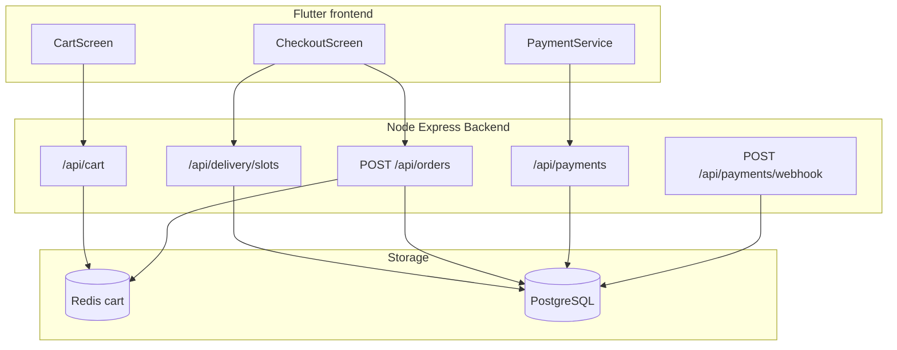
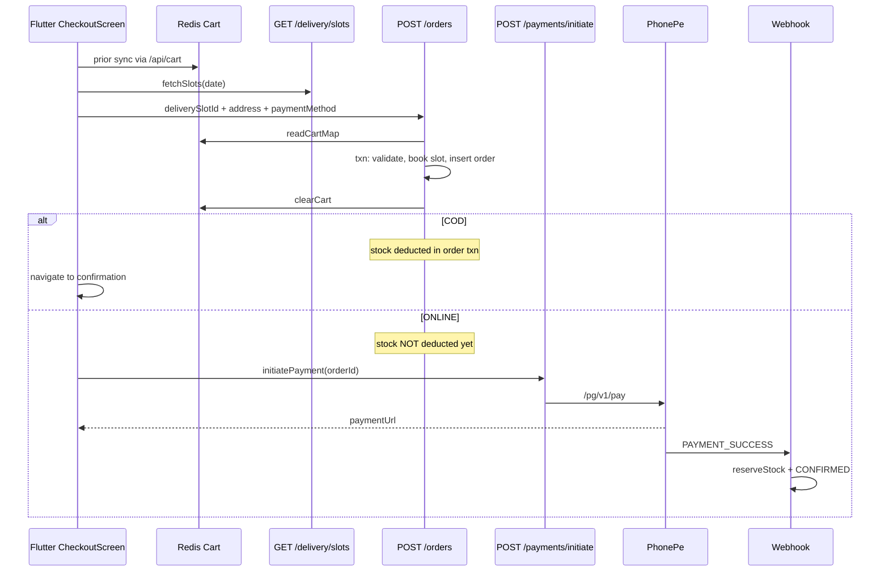
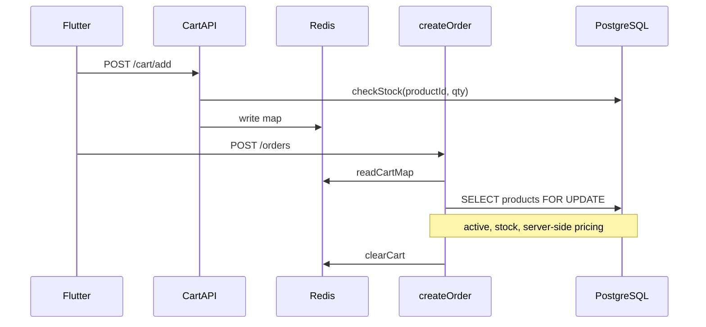
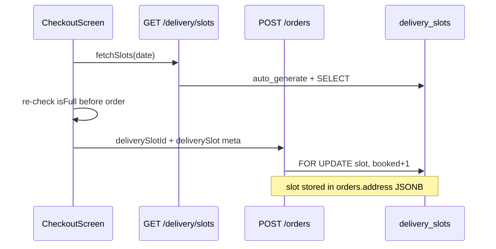
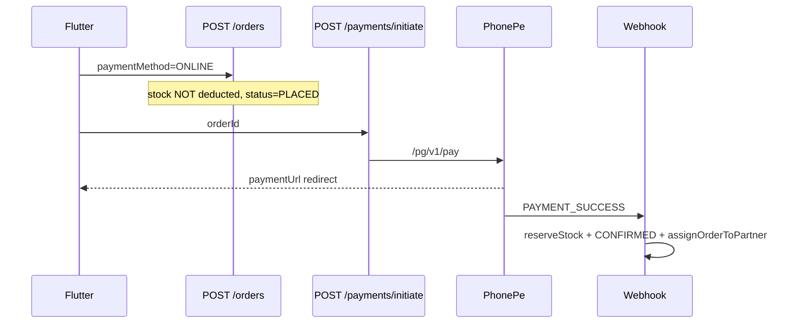
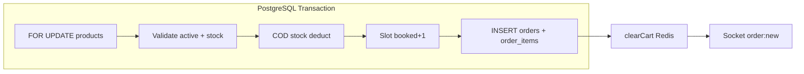

# Checkout Pipeline Architecture

End-to-end architecture for MeatvoApp checkout: cart validation, delivery slot booking, PhonePe payment (sandbox/production), atomic order creation, and webhook handling. Covers both the Node.js backend and the Flutter client (`frontend/`).

**Related docs:**
- [PhonePe Payment Integration](./phonepe-payment-integration.md) — payment API details, env setup, checksum
- [Webhook Security Fixes](./webhook-security-fixes.md) — webhook hardening changelog

---

## Table of Contents

1. [System Overview](#1-system-overview)
2. [Cart Validation](#2-cart-validation)
3. [Slot Booking](#3-slot-booking)
4. [Sandbox Payment Integration (PhonePe)](#4-sandbox-payment-integration-phonepe)
5. [Atomic Order Creation](#5-atomic-order-creation)
6. [Webhook Handling](#6-webhook-handling)
7. [Gap Register](#7-gap-register)
8. [API Quick Reference](#8-api-quick-reference)
9. [Flutter File Map](#9-flutter-file-map)

---

## 1. System Overview

Checkout is built from five coordinated subsystems that share PostgreSQL for orders/products/slots/payments and Redis for ephemeral cart state.



### Golden rule

**Orders are always created from the server-side Redis cart.** The backend reads `readCartMap(customerId)` and ignores any `items` array sent in the request body. See `backend/src/modules/orders/orders.controller.js` (lines 62–68).

The Flutter client still sends `items` in `POST /orders` for backward compatibility, but the backend does not use them. Client and server carts must stay in sync via `/api/cart` before checkout.

### Route mounting

All routes are mounted in `backend/index.js`:

| Prefix | Module |
|--------|--------|
| `/api/cart`, `/api/v1/cart` | Cart |
| `/api/orders`, `/api/v1/orders` | Orders |
| `/api/payments`, `/api/v1/payments` | Payments |
| `/api/delivery`, `/api/v1/delivery` | Delivery + slots |

### Full checkout — COD vs ONLINE



---

## 2. Cart Validation

### Architecture layers

| Layer | File | Responsibility |
|-------|------|----------------|
| Request schema | `backend/src/modules/cart/cart.validation.js` | Zod: `productId`, `quantity` (1–10 per operation) |
| Add/update guard | `backend/src/modules/cart/cart.controller.js` → `checkStock()` | Active product + stock check against DB |
| Enrichment | `cartMapToArray()` | Join products; set `isActive`, `inStock`, server price |
| Checkout re-validate | `backend/src/modules/orders/orders.controller.js` → `createOrder` | `FOR UPDATE` locks, inactive/stock/price checks |

### Data model

- **Storage:** Redis only — no PostgreSQL `cart` / `cart_items` table
- **Key:** `cart:user:{userId}`
- **Value:** JSON map `{ "productId": quantity }`
- **TTL:** 30 days (`backend/src/modules/cart/cart.service.js`, line 17)

### Validation stages



### Cart API endpoints

| Method | Path | Auth | Handler |
|--------|------|------|---------|
| GET | `/api/cart` | Bearer | `getCart` — items + total |
| GET | `/api/cart/count` | Bearer | `getCartCount` |
| POST | `/api/cart`, `/api/cart/add` | Bearer | `addToCart` |
| PUT | `/api/cart/:itemId`, `/api/cart/update` | Bearer | `updateCartItem` |
| DELETE | `/api/cart/:itemId`, `/api/cart/remove/:productId` | Bearer | `removeFromCart` |
| DELETE | `/api/cart`, `/api/cart/clear` | Bearer | `clearCart` |

Source: `backend/src/modules/cart/cart.routes.js`

### Validation rules detail

**Zod (request level):**
- `productId`: positive integer (string or number accepted)
- `quantity`: integer 1–10 on add; 0–10 on update (0 removes item)

**Stock check (`checkStock`):**
```sql
SELECT stock FROM products WHERE id = $1 AND active = true
```
Fails if product missing/inactive or `stock < qty`.

**Checkout (`createOrder`):**
- Merges duplicate product IDs in cart map
- `SELECT id, price, stock, active FROM products WHERE id = ANY($1) FOR UPDATE`
- Rejects inactive products and insufficient stock
- Computes subtotal from DB prices (client prices are not trusted)

**GET cart enrichment:**
- Missing/deleted products are filtered out silently
- Inactive or out-of-stock items remain in cart with flags (`isActive`, `inStock`) — not auto-removed

### Flutter sync requirements

| File | Role |
|------|------|
| `frontend/lib/services/cart_service.dart` | CRUD via `/api/cart`; maintains local `CartModel` notifier |
| `frontend/lib/models/cart_model.dart` | Local model with optional `variantId` (backend ignores variants) |
| `frontend/lib/screens/checkout/checkout_screen.dart` | Uses `widget.cart` passed from cart screen |

**Critical:** Before checkout, all cart mutations must go through `/api/cart`. The local `CartModel` in checkout is used for display and sends `items` to `POST /orders`, but the backend order is built from Redis.

---

## 3. Slot Booking

### Architecture

| Component | File | Role |
|-----------|------|------|
| Slot listing | `backend/src/modules/delivery/slots.controller.js` → `getAvailableSlots` | Date filter, capacity/remaining, auto-generate |
| SQL function | `auto_generate_delivery_slots()` | Called on every GET to ensure future slots exist |
| Order-time book | `backend/src/modules/orders/orders.controller.js` (lines 126–164) | `FOR UPDATE` + `booked + 1` inside order txn |
| Cancel release | `cancelOrder` (lines 459–483) | `booked - 1` when `address.deliverySlot.id` present |
| Standalone book/release | `POST /delivery/slots/:id/book\|release` | Implemented; Flutter does not call these |

### Expected database schema

```
delivery_slots (
  id, name, start_time, end_time, slot_date,
  capacity, booked, is_active
)
```

**Repo gap:** The `delivery_slots` table and `auto_generate_delivery_slots()` function are **not defined** in:
- `backend/src/db/schema.sql`
- `backend/src/db/ensureSchema.js`

The application code assumes they already exist in the database (likely applied via a migration that is referenced in `backend-report.json` as `migrations/004_add_delivery_slots.sql` but is **missing from the repository**). Fresh setups will fail on slot or order-with-slot operations until this migration is restored or applied manually.

### Slot API endpoints

| Method | Path | Auth | Handler |
|--------|------|------|---------|
| GET | `/api/delivery/slots?date=YYYY-MM-DD` | Public | `getAvailableSlots` |
| GET | `/api/delivery/slots/:id` | Public | `getSlotById` |
| POST | `/api/delivery/slots/:id/book` | Bearer (any role) | `bookSlot` |
| POST | `/api/delivery/slots/:id/release` | Bearer (any role) | `releaseSlot` |

Source: `backend/src/modules/delivery/delivery.routes.js`

Note: `updateSlotCapacity` exists in `slots.controller.js` but has **no registered route**.

### Booking flow



### Slot storage on order

When `deliverySlotId` is provided and booking succeeds, the order `address` JSONB includes:

```json
{
  "text": "...",
  "lat": 28.6,
  "lng": 77.2,
  "addressId": 5,
  "deliverySlot": {
    "id": 12,
    "name": "Morning",
    "date": "2026-05-25",
    "time": "7:00 AM - 11:00 AM"
  }
}
```

If only `deliverySlot` meta is sent (no `deliverySlotId`), metadata is saved but **capacity is not booked**.

### Availability checks

| Check | Where |
|-------|-------|
| `remaining = capacity - booked >= 1` | Order create, standalone book |
| Past `slot_date` rejected | Order create, standalone book |
| Row lock | `SELECT ... FOR UPDATE` |
| Client re-validation | Flutter fetches fresh slots immediately before order |

### Flutter dual-system

| System | File | Used where |
|--------|------|------------|
| **API slots** (authoritative) | `frontend/lib/services/delivery_slot_api_service.dart` | Checkout screen |
| **Local slots** (legacy labels) | `frontend/lib/services/delivery_time_slot_service.dart` | Cart screen Morning/Evening labels only |

Checkout (`checkout_screen.dart`) loads API slots and passes `deliverySlotId` + `deliverySlotMeta` to `createOrder`. The standalone `bookSlot()` API method exists in Dart but is **never called** — booking happens only inside `POST /orders`.

See also: [Flutter Checkout Flow](../../frontend/docs/checkout-flow.md)

---

## 4. Sandbox Payment Integration (PhonePe)

**Project rule:** PhonePe ONLY — Razorpay/Stripe are not implemented in the backend.

For detailed PhonePe API docs, checksum format, and env setup, see [PhonePe Payment Integration](./phonepe-payment-integration.md).

### Configuration

| Env var | Purpose | Used in |
|---------|---------|---------|
| `PHONEPE_API_BASE` | API host (default `https://api.phonepe.com/v1`) | `payments.controller.js` |
| `PHONEPE_MERCHANT_ID` | Merchant ID | same |
| `PHONEPE_SALT_KEY` | Checksum salt | same |
| `PHONEPE_SALT_INDEX` | Checksum suffix (default `1`) | same |
| `PHONEPE_REDIRECT_URL` | Post-payment browser redirect | same |
| `PHONEPE_WEBHOOK_URL` | Callback URL sent to PhonePe | same |
| `PHONEPE_ENVIRONMENT` | Defined in `configLoader.js` | **Not used in payment code** |

Test values in `backend/.env.test` (lines 65–71):

```
PHONEPE_API_BASE=https://api.phonepe.com/v1
PHONEPE_MERCHANT_ID=TEST_MERCHANT_ID
PHONEPE_SALT_KEY=TEST_SALT_KEY_FOR_DEVELOPMENT
PHONEPE_SALT_INDEX=1
PHONEPE_REDIRECT_URL=http://localhost:3000/payment/return
PHONEPE_WEBHOOK_URL=http://localhost:3000/api/payments/phonepe/webhook
```

### Sandbox vs production behavior

| Environment | Missing PhonePe config |
|-------------|------------------------|
| Production (`NODE_ENV=production`) | Process throws at startup |
| Non-production | Error logged; server starts |

**Gap:** No automatic UAT/sandbox URL switch. `PHONEPE_ENVIRONMENT` is unused; developers must set `PHONEPE_API_BASE` manually to PhonePe's UAT host for sandbox testing. `.env.test` currently points at the production API base URL.

### Local sandbox testing

1. Set PhonePe UAT credentials in `.env` or `.env.test`
2. Run backend: `node backend/test-payment.js` for initiate smoke test
3. For webhooks locally, expose the server via ngrok and set `PHONEPE_WEBHOOK_URL` to the public URL + `/api/payments/phonepe/webhook`
4. Flutter polls `GET /api/payments/:orderId/status` as fallback when webhook delivery is delayed

### Payment API endpoints

| Method | Path | Auth | Handler |
|--------|------|------|---------|
| POST | `/api/payments/initiate`, `/api/payments/phonepe/initiate` | Bearer | `initiatePayment` (10 req/min per user) |
| GET | `/api/payments/:orderId/status` | Bearer | `getPaymentStatus` |
| POST | `/api/payments/webhook`, `/api/payments/phonepe/webhook` | Public (X-VERIFY) | `handlePhonePeWebhook` (rate limited) |

### ONLINE payment flow



### Stock timing by payment mode

| Mode | Stock deducted | Order status after create |
|------|----------------|---------------------------|
| COD | Inside `createOrder` transaction | `PLACED` |
| ONLINE | On webhook/status `PAYMENT_SUCCESS` via `reserveStockForPaidOrder` | `PLACED` until paid → `CONFIRMED` |

### Unused / duplicate code

| File | Status |
|------|--------|
| `backend/src/modules/payments/phonepe.service.js` | Standalone class with refund helpers — **not wired to routes** |
| `backend/src/security/payment.security.js` | Fraud detection helpers — **not applied to routes** |
| `backend/test-payment.js` | Local initiate smoke test |

### Flutter payment integration

| File | Methods |
|------|---------|
| `frontend/lib/services/payment_service.dart` | `initiatePayment()`, `getPaymentStatusForOrder()`, `verifyPayment()` |
| `frontend/lib/screens/checkout/checkout_screen.dart` | `_PaymentStatusPoller` polls status after PhonePe redirect |

**Gap:** Flutter calls `POST /payments/verify` (`payment_service.dart` line 52) — this route **does not exist** on the backend. Use `GET /payments/:orderId/status` instead.

---

## 5. Atomic Order Creation

### Entry point

`POST /api/orders` → `createOrder` in `backend/src/modules/orders/orders.controller.js`

Validation schema: `backend/src/modules/orders/orders.validation.js`

### Transaction boundary

Uses `withTransaction()` from `backend/src/db/postgres.js`:

```javascript
await client.query('BEGIN');
// ... work ...
await client.query('COMMIT');  // or ROLLBACK on error
```

Steps **inside** the transaction:

1. `SELECT id, price, stock, active FROM products WHERE id = ANY($1) FOR UPDATE`
2. Validate all products exist, active, sufficient stock
3. Compute subtotal from DB prices
4. Apply delivery charge: `subtotal >= 500 ? 0 : 40`
5. **COD:** deduct stock per product
6. **ONLINE:** skip stock deduction
7. If `deliverySlotId`: lock slot row, check capacity/date, `booked + 1`
8. Insert `orders` row (status `PLACED`, `payment_mode` COD/ONLINE)
9. Bulk insert `order_items` via `UNNEST`

Steps **outside** the transaction:

1. `clearCart(customerId)` — Redis delete
2. Socket.IO `order:new` to `admin_room`
3. Payment initiation (separate transaction, ONLINE only)
4. Post-payment: webhook → stock + confirm + rider assignment



### Pricing rules (hardcoded)

| Rule | Value |
|------|-------|
| Delivery charge | ₹0 if subtotal ≥ ₹500, else ₹40 |
| Coupon | `POST /orders/apply-coupon` previews discount only; `createOrder` **ignores** `couponCode` field |

### Cancel order atomicity

`PUT /api/orders/:id/cancel` uses `withTransaction()` to:
1. Restore stock for all order items
2. Release delivery slot (`booked - 1`) if slot ID in address
3. Set status `CANCELLED`

Allowed from statuses: `PLACED`, `CONFIRMED` (customer-owned orders only).

### Non-atomic edges (operational risks)

| Edge | Risk |
|------|------|
| `clearCart` after txn commit | Server crash between commit and clear → user could retry and create duplicate order |
| PhonePe HTTP inside payment initiate txn | External API call holds DB transaction open |
| ONLINE order + booked slot + payment failure | Slot stays booked until user cancels |
| Cancel restores stock unconditionally | For paid ONLINE orders, stock is restored but refund flow is incomplete |

---

## 6. Webhook Handling

For the security hardening changelog, see [Webhook Security Fixes](./webhook-security-fixes.md).

### Endpoints

| Path | Rate limit | Auth |
|------|------------|------|
| `POST /api/payments/phonepe/webhook` | 10/min | `X-VERIFY` checksum |
| `POST /api/payments/webhook` | 10/min | alias of above |

Source: `backend/src/modules/payments/payments.routes.js`

### Security pipeline

Handler: `handlePhonePeWebhook` in `backend/src/modules/payments/payments.controller.js`

1. Require `X-VERIFY` header
2. Canonical JSON checksum: `SHA256(payload + SALT_KEY) + '###' + SALT_INDEX`
3. Whitelist event codes: `PAYMENT_SUCCESS`, `PAYMENT_FAILED`, `PAYMENT_REFUNDED`
4. Require `merchantTransactionId`, `transactionId`, `amount` in `data`
5. Amount match: webhook amount (paise) must equal `payment_transactions.amount * 100`
6. Idempotency: skip processing if payment status is already past `INITIATED`/`PENDING` (returns HTTP 200)
7. Unknown transaction: HTTP 200 (avoid PhonePe retry loops)

### Event handling

| Event | Payment status | Order status | Stock | Slot |
|-------|---------------|--------------|-------|------|
| `PAYMENT_SUCCESS` | SUCCESS | CONFIRMED, payment_status PAID | Deduct via `reserveStockForPaidOrder` | Stays booked |
| `PAYMENT_FAILED` | FAILED | PLACED, payment_status FAILED | No change | Not released |
| `PAYMENT_REFUNDED` | REFUNDED | payment_status REFUNDED only | Not restored | N/A |

On `PAYMENT_SUCCESS`:
- `assignOrderToPartner()` called after commit
- Socket `order:new` emitted to admin room

### Fallback: status polling

`GET /api/payments/:orderId/status`:
- Returns current payment row
- If status is `PENDING`, calls PhonePe status API
- On `COMPLETED`, runs same stock + confirm logic as webhook success

Flutter `_PaymentStatusPoller` uses this as the primary client-side confirmation path.

### Logging

Structured masked logs via `backend/src/modules/payments/secure-logger.js` (`paymentLogger.webhook.*`).

---

## 7. Gap Register

Prioritized known issues in the current implementation. These are documented for awareness; fixes are tracked separately.

| Priority | Area | Gap | Impact |
|----------|------|-----|--------|
| P0 | Slots | `delivery_slots` table + `auto_generate_delivery_slots()` missing from repo schema/migrations | Fresh DB setup breaks slot APIs and order booking |
| P0 | Cart sync | Backend ignores client `items`; order uses Redis only | Mismatch if local Flutter cart ≠ server cart |
| P1 | Cart | No `GET /cart/validate` pre-checkout endpoint | Stale/inactive items discovered only at order time |
| P1 | Cart | `addToCart` checks new `qty`, not `currentQty + qty` | Cumulative stock bypass possible |
| P1 | Payment | Flutter `POST /payments/verify` — backend route missing | Verify calls fail; polling works |
| P1 | Payment | `PHONEPE_ENVIRONMENT` unused; no UAT URL auto-switch | Sandbox setup requires manual config |
| P2 | Slots | `deliverySlotId` optional — meta-only orders skip capacity booking | Overbooking risk for display-only slots |
| P2 | Slots | Payment failure does not release slot | Slot consumed until manual cancel |
| P2 | Slots | Admin cancel does not release slot | Capacity leak on admin-side cancellations |
| P2 | Order | `couponCode` accepted in schema but ignored in `createOrder` | Coupon preview ≠ checkout total |
| P2 | Order | `clearCart` outside transaction | Duplicate order risk on crash/retry |
| P2 | Cart | Inactive items not auto-removed from Redis cart | User sees invalid items until checkout fails |
| P3 | Cart | Product variants in Flutter model; backend has no variant support | Variant selection has no effect |
| P3 | Slots | `updateSlotCapacity` not routed | Admin cannot adjust capacity via API |
| P3 | Slots | Redis cache constants defined but GET not cached | Minor perf gap |
| P3 | Payment | `phonepe.service.js` duplicate/unused | Maintenance confusion |
| P3 | Payment | Refund webhook updates status only; no stock restore | Inventory drift after refunds |
| P3 | Payment | `payment.security.js` fraud helpers unwired | Extra validation unused |

---

## 8. API Quick Reference

### Cart (all require Bearer token)

| Method | Path | Body / params |
|--------|------|---------------|
| GET | `/api/cart` | — |
| GET | `/api/cart/count` | — |
| POST | `/api/cart/add` | `{ productId, quantity }` |
| PUT | `/api/cart/:itemId` | `{ quantity }` (0 = remove) |
| DELETE | `/api/cart/:itemId` | — |
| DELETE | `/api/cart/clear` | — |

### Delivery slots

| Method | Path | Auth | Body / params |
|--------|------|------|---------------|
| GET | `/api/delivery/slots` | Public | `?date=YYYY-MM-DD` optional |
| GET | `/api/delivery/slots/:id` | Public | — |
| POST | `/api/delivery/slots/:id/book` | Bearer | `{ quantity }` optional |
| POST | `/api/delivery/slots/:id/release` | Bearer | `{ quantity }` optional |

### Orders (customer)

| Method | Path | Auth | Body |
|--------|------|------|------|
| POST | `/api/orders` | Bearer | `{ deliveryAddress, paymentMethod, lat?, lng?, addressId?, deliverySlotId?, deliverySlot?, couponCode? }` |
| POST | `/api/orders/apply-coupon` | Bearer | `{ code, orderTotal }` |
| GET | `/api/orders`, `/api/orders/my` | Bearer | — |
| GET | `/api/orders/:id` | Bearer | — |
| PUT | `/api/orders/:id/cancel` | Bearer | — |

### Payments

| Method | Path | Auth | Body |
|--------|------|------|------|
| POST | `/api/payments/initiate` | Bearer | `{ orderId }` |
| GET | `/api/payments/:orderId/status` | Bearer | — |
| POST | `/api/payments/webhook` | X-VERIFY | PhonePe webhook payload |

---

## 9. Flutter File Map

| Screen / widget | Service | Backend endpoints |
|-----------------|---------|-------------------|
| Cart screen | `cart_service.dart` | `/api/cart/*` |
| Checkout screen | `order_service.dart`, `delivery_slot_api_service.dart`, `payment_service.dart`, `delivery_service.dart` | `/api/orders`, `/api/delivery/slots`, `/api/payments/*`, `/api/store/check-delivery` |
| Checkout delivery UI | `checkout_delivery_sections.dart` | Slot picker, address sections |
| Payment status screen | `_PaymentStatusPoller` in `checkout_screen.dart` | `GET /api/payments/:orderId/status` |
| Order history | `order_service.dart` | `GET /api/orders` |

Detailed Flutter flow: [frontend/docs/checkout-flow.md](../../frontend/docs/checkout-flow.md)

### Backend source files

| Module | Path |
|--------|------|
| Cart | `backend/src/modules/cart/` |
| Orders | `backend/src/modules/orders/orders.controller.js` |
| Slots | `backend/src/modules/delivery/slots.controller.js` |
| Payments | `backend/src/modules/payments/payments.controller.js` |
| DB transactions | `backend/src/db/postgres.js` |
| Redis cart | `backend/src/modules/cart/cart.service.js` |
