# Meatvo App Flows — Implementation Reference

**Version:** 1.0  
**Date:** June 13, 2026  
**Status:** Implementation-ready  
**Platforms:** Customer Mobile App · Rider Mobile App · Admin Mobile App

Production-aligned flows for Customer, Admin, and Rider. Screen names map to `frontend/lib/screens/`; API paths to `backend/src/modules/`.

---

## Global Conventions

| Item | Value |
|------|-------|
| API base | `{BACKEND_ROOT}/api` |
| Auth | JWT access + refresh in `flutter_secure_storage` |
| Realtime | Socket.io — customer room `customer_{userId}`, admin `admin_room`, riders `riders` / `delivery_{partnerId}` |
| Order statuses (canonical) | `PLACED` → `CONFIRMED` → `PACKED` → `OUT_FOR_DELIVERY` → `DELIVERED` (see `backend/src/utils/orderStatus.js`) |
| Role routing | `destinationAfterAuth()` in `app_destinations.dart` |

---

# CUSTOMER FLOWS

---

## 1. Onboarding

First-time users see value props, grant location, and save a default address before the home tab shell.

### Flowchart

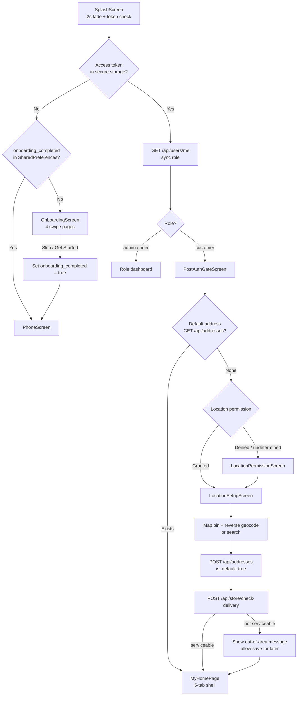

### Implementation notes

| Step | Screen / Service | API / Storage |
|------|------------------|---------------|
| Splash | `splash_screen.dart` | `StorageService.getAccessToken()`, `AuthService.getMe()` |
| Onboarding carousel | `onboarding_screen.dart` | `SharedPreferences`: `onboarding_completed` |
| Post-auth gate | `post_auth_gate_screen.dart` | `AddressService.getDefaultAddress()` |
| Location setup | `location_setup_screen.dart` | `POST /api/addresses`, `POST /api/store/check-delivery` |
| Home shell | `main.dart` → `MyHomePage` | Tabs: Home, Categories, Cart, Orders, Profile |

**Current gap:** ~~`SplashScreen` routes unauthenticated users directly to `PhoneScreen`~~ — wired in v1.1 (splash → onboarding when `!onboarding_completed`).

**Onboarding pages (4):** Farm Fresh → Fast Delivery → Easy Ordering → final CTA.

---

## 2. Login

Phone OTP auth shared across all roles; post-verify routing is role-based.

### Sequence diagram

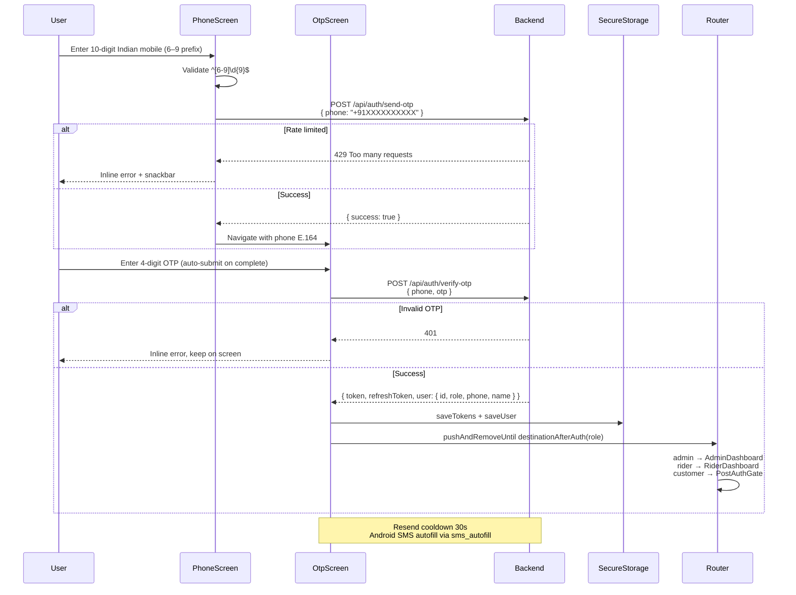

### Flowchart (error paths)

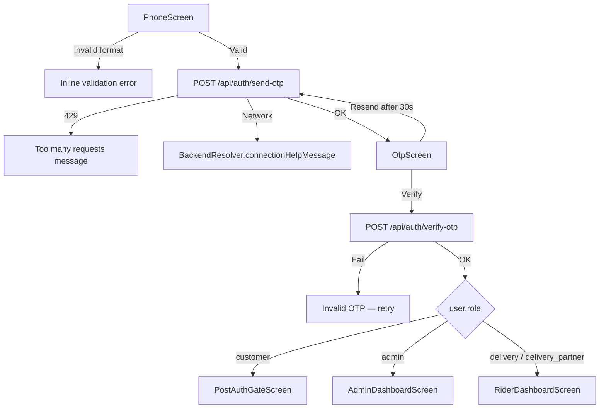

### Implementation notes

- **Files:** `phone_screen.dart`, `otp_screen.dart`, `auth_service.dart`
- **Rate limits:** IP + OTP limiters on auth routes (`auth.routes.js`)
- **Token refresh:** `ApiClient` interceptor → `POST /api/auth/refresh-token`
- **Logout:** `POST /api/auth/logout` + clear storage

---

## 3. Browse Products

Discovery from home, categories, search, and product detail — gated on serviceability when location is set.

### Flowchart

```mermaid
flowchart TD
    A[HomeScreen<br/>homeViewModelProvider.initialize] --> B[Parallel fetch]
    B --> B1[GET /api/banners]
    B --> B2[GET /api/categories]
    B --> B3[GET /api/products?featured=true]
    B --> B4[GET /api/store/status]
    A --> C{Default address<br/>missing?}
    C -->|Yes| D[LocationOnboardingSheet]
    C -->|No| E[Show catalog content]
    E --> F{User action}
    F -->|Tap category| G[CategoryProductsScreen<br/>GET /api/products?categoryId=]
    F -->|Tap product| H[ProductDetailScreen<br/>GET /api/products/:id]
    F -->|Search| I[SearchScreen<br/>GET /api/products?q=]
    F -->|Banner tap| J[Deep link → category / product / URL]
    H --> K{In stock & active?}
    K -->|No| L[Disabled Add button + message]
    K -->|Yes| M[Select quantity 1–10]
    M --> N[POST /api/cart<br/>{ productId, quantity }]
    N --> O[Update cart badge<br/>CartService stream]
    O --> P[Optional: floating cart bar → Cart tab]
```

### Implementation notes

| Concern | Detail |
|---------|--------|
| State | Riverpod `homeViewModelProvider`; cart via `CartService` + providers |
| Stock | Server enriches cart with `inStock`, `isActive`, live price |
| Serviceability | `POST /api/store/check-delivery` with lat/lng before checkout (browse may show store-closed banner via `ExpressDeliveryService`) |
| Empty/error | Shimmer → content; retry on network failure |
| Images | Cached network images with shimmer placeholder |

---

## 4. Cart

Redis-backed server cart; client mirrors state for badge and checkout.

### Flowchart

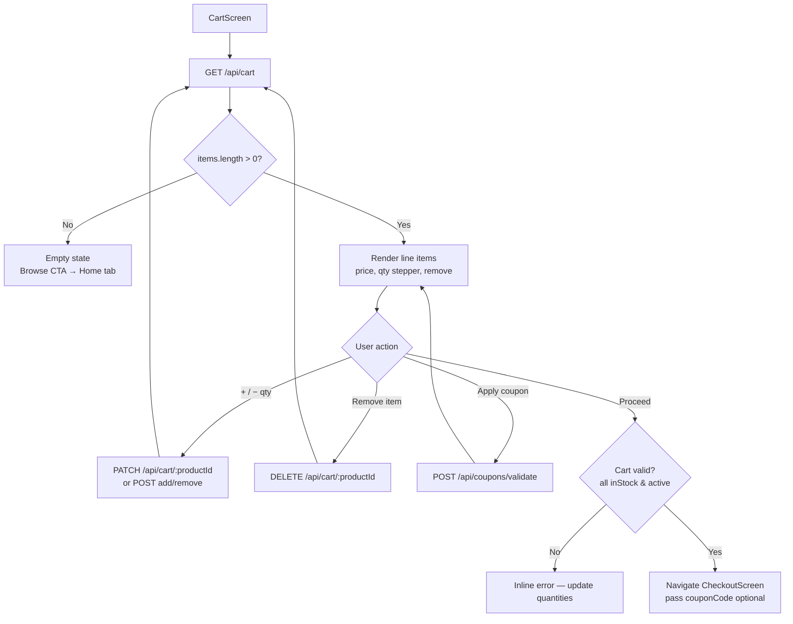

### Implementation notes

- **Golden rule:** Checkout reads cart from Redis on server (`readCartMap(customerId)`); client must sync via `/api/cart` before order placement.
- **Quantity cap:** 1–10 per add operation (Zod validation).
- **Files:** `cart_screen.dart`, `cart_service.dart`, `backend/src/modules/cart/`

---

## 5. Checkout

Progressive disclosure: Address → Slot → Payment → Confirm.

### Flowchart

```mermaid
flowchart TD
    A[CheckoutScreen] --> B[Load prerequisites]
    B --> B1[GET /api/addresses]
    B --> B2[GET /api/delivery/slots?date=today]
    B --> B3[GET /api/cart — fresh sync]
    A --> C{Validations}
    C --> C1[Address selected + lat/lng pinned]
    C --> C2[Slot selected & available]
    C --> C3[Store open — ExpressDeliveryService]
    C --> C4[POST /api/store/check-delivery]
    C -->|Any fail| D[Snackbar + block Place Order]
    C -->|Pass| E[User selects payment<br/>COD | ONLINE]
    E --> F[Tap Place Order]
    F --> G[POST /api/orders]
    G --> H{payment_mode}
    H -->|COD| I[status: CONFIRMED<br/>stock deducted in txn<br/>cart cleared]
    H -->|ONLINE| J[status: PLACED<br/>stock reserved on payment<br/>cart cleared]
    I --> K[Success overlay 1.4s]
    K --> L[OrderConfirmationScreen]
    J --> M[Payment flow → §6]
```

### Request payload (`POST /api/orders`)

```json
{
  "addressId": 123,
  "deliveryAddress": { "latitude", "longitude", "address_line1": "..." },
  "deliverySlotId": 45,
  "deliverySlot": "Express · 30 min",
  "deliverySlotMeta": { "name", "date", "time" },
  "paymentMethod": "COD",
  "couponCode": "MEAT10"
}
```

### Implementation notes

- **File:** `checkout_screen.dart` → `_placeOrder()`
- Slot re-validated via `GET /api/delivery/slots/:id` before submit
- Transaction: lock products `FOR UPDATE`, book slot capacity, insert order + items, clear Redis cart
- **COD initial status:** `CONFIRMED` | **ONLINE initial status:** `PLACED`

---

## 6. Payment

PhonePe redirect + polling; webhook is source of truth for stock and confirmation.

### Sequence diagram

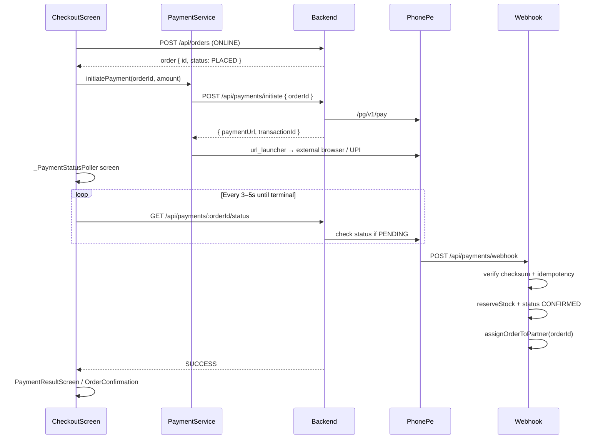

### Flowchart

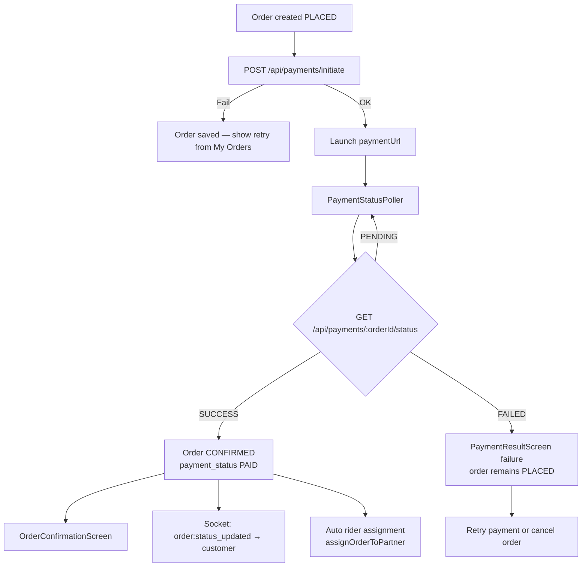

### Implementation notes

- **Files:** `payment_service.dart`, `payment_result_screen.dart`, `payments.controller.js`
- **Verify fallback:** `POST /api/payments/verify { transactionId }`
- **Never deduct stock on ONLINE order create** — only on webhook/verify SUCCESS

---

## 7. Order Tracking

List, detail, live map, and socket-driven updates until terminal state.

### State diagram

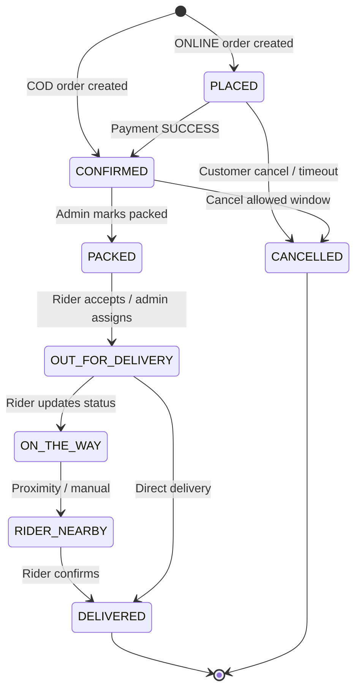

### Customer tracking flowchart

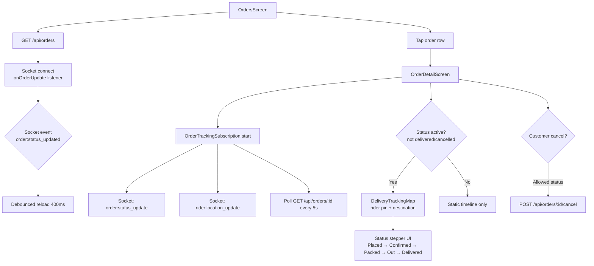

### Customer-visible status labels

| Backend status | UI label | Map visible? |
|----------------|----------|--------------|
| `PLACED` | Order placed | Optional |
| `CONFIRMED` | Confirmed | Yes |
| `PACKED` | Being packed | Yes |
| `OUT_FOR_DELIVERY` | Out for delivery | Yes |
| `ON_THE_WAY` | On the way | Yes |
| `RIDER_NEARBY` | Rider nearby | Yes |
| `DELIVERED` | Delivered | No |
| `CANCELLED` | Cancelled | No |

### Implementation notes

- **Files:** `orders_screen.dart`, `order_detail_screen.dart`, `order_tracking_subscription.dart`, `delivery_tracking_map.dart`
- **Socket events:** `order:status_updated`, `order:status_update`, `partner:accepted`, `order:partner_assigned`, location updates via `tracking.service.js`

---

# ADMIN FLOWS

---

## 8. Admin Login

Same OTP pipeline; role gate on backend and client.

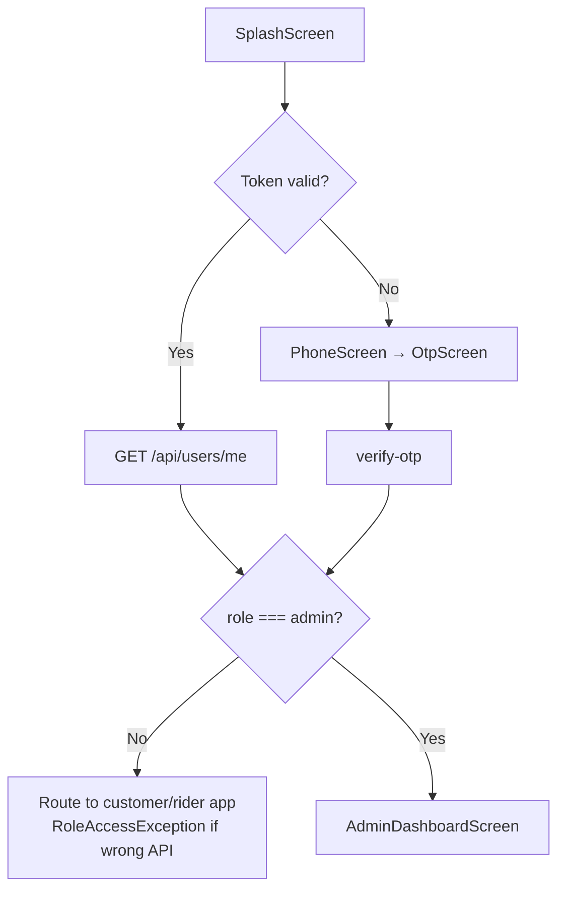

**Security:** Admin API routes use `adminOnly` middleware + optional IP allowlist (`adminOnlyIp.middleware.js`). Non-admin JWT receives 403 on `/api/admin/*`.

---

## 9. Admin Dashboard

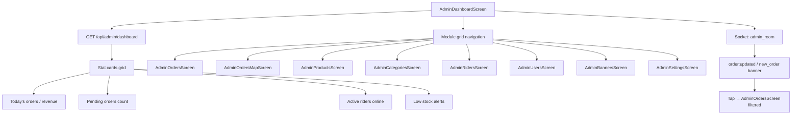

### Implementation notes

- **File:** `admin_dashboard_screen.dart`, `admin_service.dart`
- **Layout:** Flat hub — no bottom nav; back returns to dashboard
- **Realtime:** Subscribe to `admin_room` for live order alerts

---

## 10. Admin Product Management

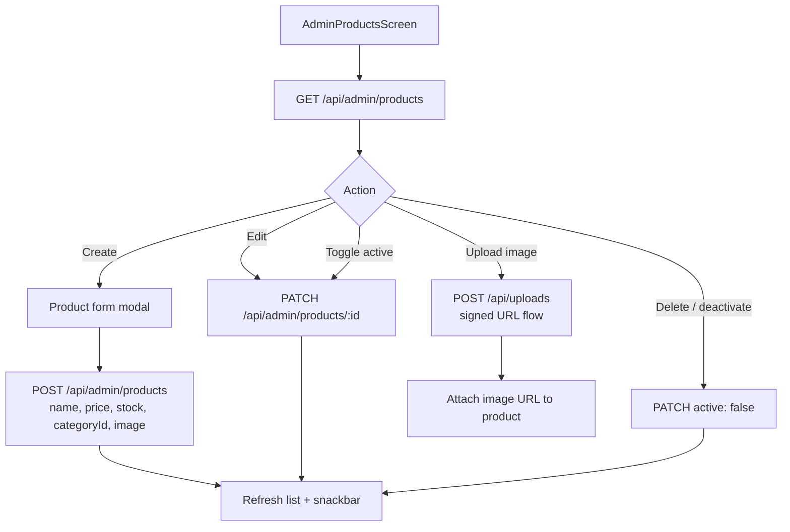

### Validation checklist

| Field | Rule |
|-------|------|
| name | Required, max 200 |
| price | > 0, 2 decimal |
| stock | ≥ 0 integer |
| categoryId | Must exist |
| image | HTTPS or signed upload path |

---

## 11. Admin Order Management

```mermaid
flowchart TD
    A[AdminOrdersScreen] --> B[GET /api/admin/orders<br/>filters: status, date]
    B --> C[Order list cards]
    C --> D[Tap order → detail bottom sheet]
    D --> E{Action}
    E -->|Update status| F[Confirm dialog]
    F --> G[PATCH /api/admin/orders/:id/status<br/>{ status: CONFIRMED|PACKED|... }]
    G --> H[Socket → customer order:status_updated]
    E -->|Cancel| I[PATCH /api/admin/orders/:id<br/>orderStatus: CANCELLED]
    I --> J[Release slot / refund if paid]
    E -->|Assign rider| K[Rider picker dropdown]
    K --> L[PATCH /api/admin/orders/:id<br/>orderStatus: ASSIGNED<br/>deliveryUserId: partnerId]
    L --> M[order_assignments INSERT status ASSIGNED]
    M --> N[Socket → rider order:assigned]
    E -->|View on map| O[AdminOrdersMapScreen]
```

### Valid admin status transitions

Uses `canTransition()` from order state machine — e.g. `CONFIRMED → PACKED`, `PACKED → OUT_FOR_DELIVERY` (via rider accept), `* → CANCELLED` where allowed.

### Status update mapping (Flutter → backend)

`AdminService._mapOrderStatusToBackend()` normalizes UI strings to uppercase enum values before `PATCH`.

---

## 12. Admin Rider Assignment

Manual assignment and auto-assignment paths.

```mermaid
flowchart TD
    subgraph Manual
        A1[Admin selects order PACKED/CONFIRMED] --> A2[Pick rider from GET /api/admin/delivery-partners]
        A2 --> A3[PATCH /api/admin/orders/:id<br/>ASSIGNED + deliveryUserId]
        A3 --> A4[Rider sees order in GET /api/delivery/orders]
    end

    subgraph Auto
        B1[Order reaches CONFIRMED<br/>payment webhook or COD create] --> B2[assignOrderToPartner]
        B2 --> B3{Tier search 3→5→8 km}
        B3 -->|Match found| B4[INSERT order_assignments ASSIGNED]
        B4 --> B5[Socket order:assigned → rider]
        B5 --> B6[30s timeout → reassign if no accept]
        B3 -->|No match| B7[Broadcast order:broadcast → riders room]
    end

    subgraph Bulk
        C1[AdminOrdersMapScreen] --> C2[POST /api/admin/delivery/assign-routes]
        C2 --> C3[Multi-order route per rider]
    end
```

### Assignment scoring (`assignment.service.js`)

| Factor | Weight |
|--------|--------|
| Distance | 35% |
| Acceptance rate | 25% |
| Current load | 20% |
| Rating | 10% |
| Zone familiarity | 10% |

**Max attempts:** 3 per order (`MAX_ASSIGNMENT_ATTEMPTS`); then admin manual assignment required.

---

# RIDER FLOWS

---

## 13. Rider Login

```mermaid
flowchart TD
    A[Same OTP flow as customer] --> B[verify-otp returns role delivery/delivery_partner]
    B --> C[RiderDashboardScreen]
    C --> D[GET /api/delivery/me]
    D --> E{approved?}
    E -->|No| F[Blocked state — contact admin]
    E -->|Yes| G[Dashboard ready]
    G --> H[Toggle online POST /api/delivery/online<br/>{ online: true, lat, lng }]
    H --> I[Eligible for assignments]
```

---

## 14. Rider Accept Order

```mermaid
flowchart TD
    A[Rider online] --> B{Notification source}
    B -->|Socket order:assigned| C[Snackbar + sound]
    B -->|Socket order:broadcast| C
    B -->|Poll GET /api/delivery/orders| D[Orders tab list]
    C --> E[RiderOrderDetailScreen]
    D --> E
    E --> F{Assignment status}
    F -->|assigned / null| G[Show Accept | Reject]
    F -->|accepted| H[Show delivery actions]
    G -->|Accept| I[POST /api/delivery/orders/:id/accept]
    I --> J[order_assignments → ACCEPTED<br/>orders.status → OUT_FOR_DELIVERY]
    J --> K[Socket → customer partner:accepted]
    J --> L[Start location streaming]
    G -->|Reject| M[POST /api/delivery/orders/:id/reject]
    M --> N[Reassign via assignOrderToPartner]
    I -->|409 already assigned| O[Show error — order taken]
```

### Accept preconditions (server)

- Order status ∈ `{ CONFIRMED, PACKED }`
- Rider has `delivery_partners` profile, `approved = true`, `is_online = true`
- No conflicting assignment to another rider

---

## 15. Rider Navigation

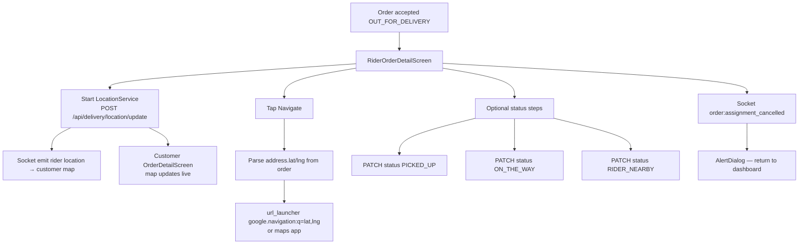

### Location update payload

```json
POST /api/delivery/location/update
{ "lat": 28.6139, "lng": 77.2090, "orderId": "12345" }
```

**Tracking service:** `tracking.service.js` persists + emits to customer socket room.

---

## 16. Rider Delivery Confirmation

```mermaid
flowchart TD
    A[Rider at customer address] --> B[Tap Mark Delivered]
    B --> C[Confirm dialog<br/>This action cannot be undone]
    C -->|Cancel| D[Stay on screen]
    C -->|Confirm| E[PATCH /api/delivery/orders/:id/status<br/>{ status: DELIVERED }]
    E --> F[order_assignments → DELIVERED]
    F --> G[Record earnings via earnings.service]
    G --> H[Stop location streaming]
    H --> I[Success dialog Order Delivered!]
    I --> J[Pop to RiderDashboardScreen]
    E --> K[Socket → customer status DELIVERED]
    K --> L[Customer tracking stops polling]
```

### Future enhancement (backend ready)

`deliveryProof.service.js` supports delivery OTP + photo proof upload — wire UI when product requires proof-of-delivery photos.

**Current client:** `markOrderDelivered()` calls status PATCH only (no photo upload yet).

---

# Cross-Role End-to-End Sequence

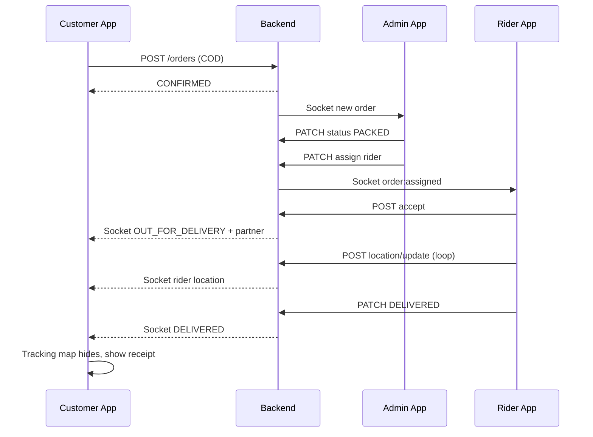

---

# Implementation Checklist by Screen

| Flow | Primary Flutter screens | Primary API endpoints |
|------|-------------------------|----------------------|
| Onboarding | `splash`, `onboarding`, `post_auth_gate`, `location_setup` | `/addresses`, `/store/check-delivery` |
| Login | `phone`, `otp` | `/auth/send-otp`, `/auth/verify-otp` |
| Browse | `home`, `category_products`, `product_detail`, `search` | `/products`, `/categories`, `/banners`, `/cart` |
| Cart | `cart` | `/cart` CRUD |
| Checkout | `checkout` | `/orders`, `/delivery/slots`, `/store/check-delivery` |
| Payment | `checkout` poller, `payment_result`, `order_confirmation` | `/payments/initiate`, `/payments/:id/status`, webhook |
| Tracking | `orders`, `order_detail` | `/orders/:id` + sockets |
| Admin login | same auth → `admin_dashboard` | `/users/me`, `/admin/*` |
| Admin dashboard | `admin_dashboard` | `/admin/dashboard` |
| Products | `admin_products` | `/admin/products` CRUD |
| Orders | `admin_orders`, `admin_orders_map` | `/admin/orders`, PATCH status/assign |
| Rider login | same auth → `rider_dashboard` | `/delivery/me`, `/delivery/online` |
| Accept | `rider_order_detail` | `/delivery/orders/:id/accept\|reject` |
| Navigation | `rider_order_detail` + maps | `/delivery/location/update` |
| Delivery | `rider_order_detail` | PATCH status `DELIVERED` |

---

## Related Documents

- [UI/UX Specification](./UI_UX_SPECIFICATION.md) — screen specs, design tokens, navigation map
- [API Reference](./API_REFERENCE.md) — endpoint details
- [Checkout Pipeline Architecture](../backend/docs/checkout-pipeline-architecture.md) — payment + order creation internals
