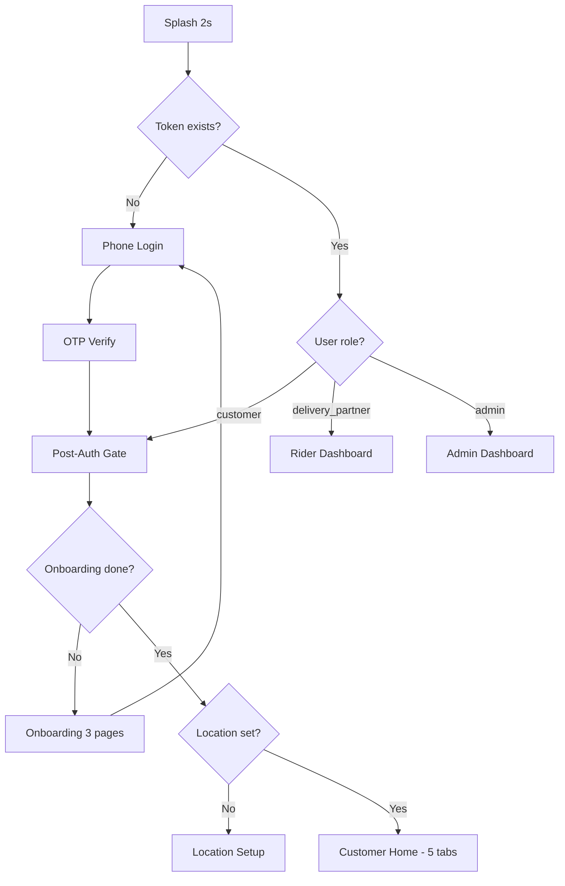
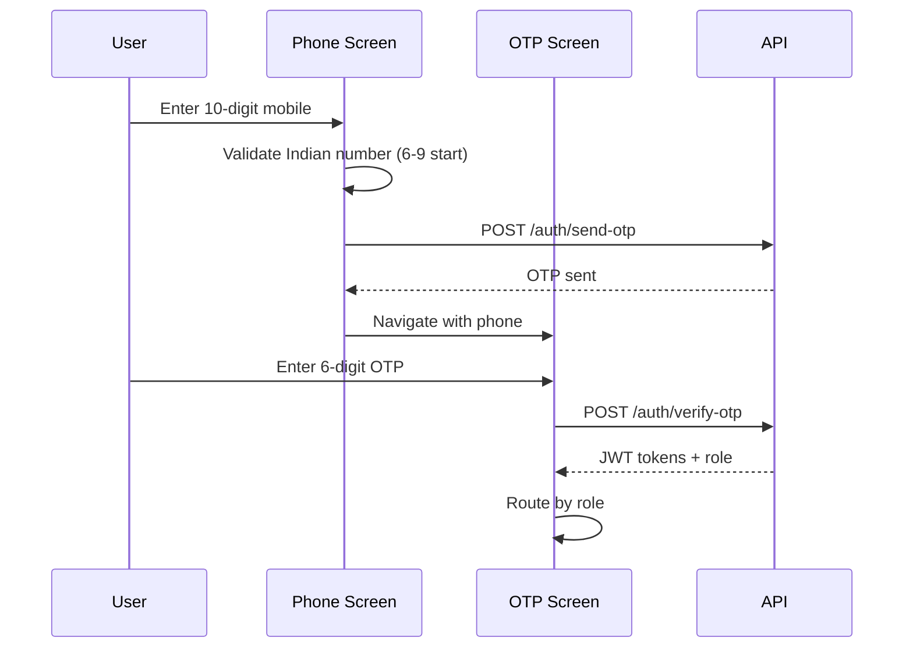
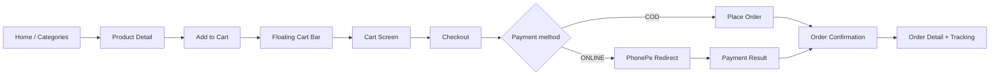
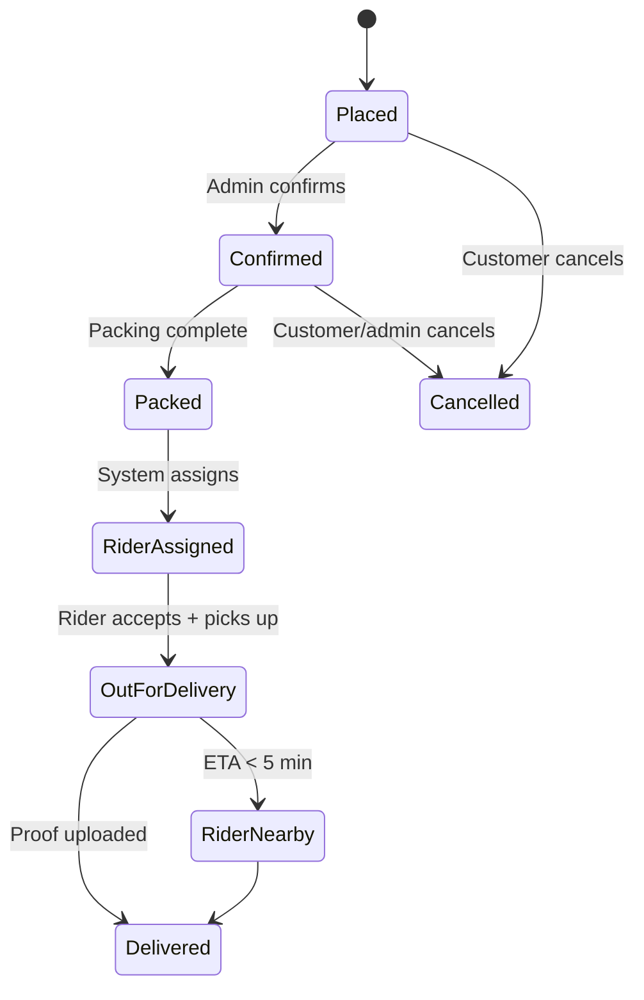
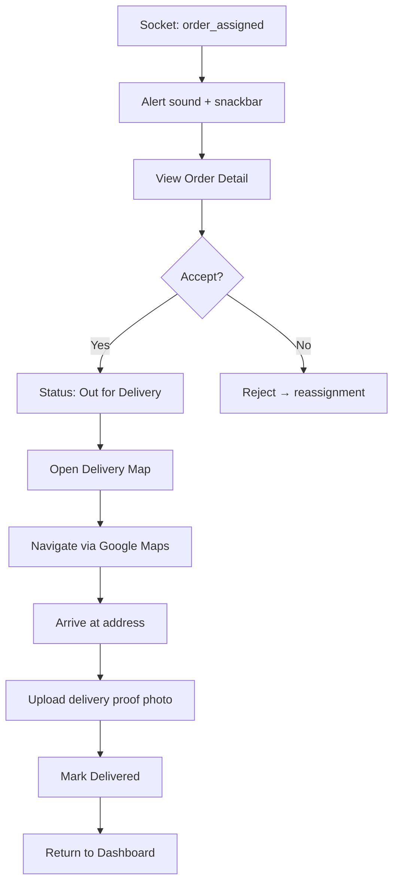
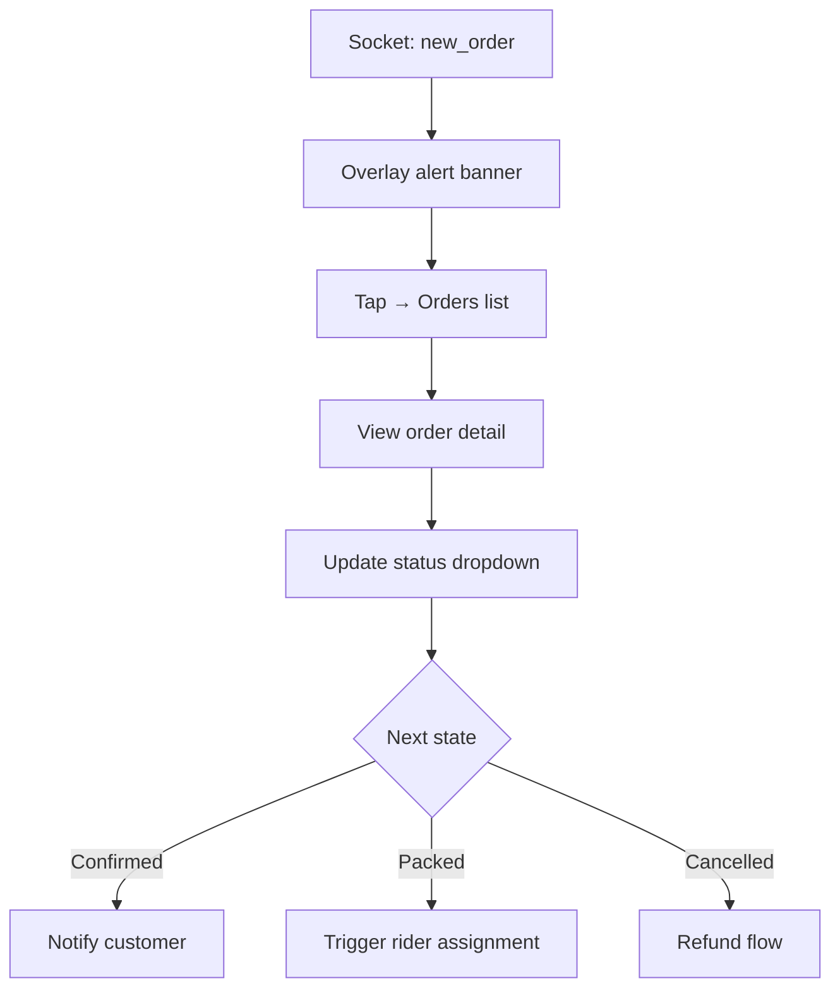

# Meatvo — UI/UX Specification Document

**Version:** 1.0  
**Date:** June 13, 2026  
**Status:** Figma-ready  
**Platforms:** Customer Mobile App · Rider Mobile App · Admin Mobile App · Web Admin (future)

---

## Table of Contents

1. [Document Purpose & Figma Setup](#1-document-purpose--figma-setup)
2. [Design Principles](#2-design-principles)
3. [Design System](#3-design-system)
4. [Typography](#4-typography)
5. [Color System](#5-color-system)
6. [Components](#6-components)
7. [Navigation](#7-navigation)
8. [User Flows](#8-user-flows)
9. [Screen Specifications — Customer App](#9-screen-specifications--customer-app)
10. [Screen Specifications — Rider App](#10-screen-specifications--rider-app)
11. [Screen Specifications — Admin App](#11-screen-specifications--admin-app)
12. [Empty States](#12-empty-states)
13. [Loading States](#13-loading-states)
14. [Error States](#14-error-states)
15. [Accessibility & Localization](#15-accessibility--localization)
16. [Appendix: Figma Component Library Checklist](#16-appendix-figma-component-library-checklist)

---

## 1. Document Purpose & Figma Setup

### 1.1 Purpose

This document is the single source of truth for Meatvo's visual and interaction design. It is written for:

- **Product designers** building Figma files
- **Engineers** implementing Flutter screens
- **QA** validating UI consistency across states

All values are production-aligned with `frontend/lib/design_system/` and `frontend/lib/core/constants/app_constants.dart`.

### 1.2 Figma File Structure

Create one Figma project with four pages:

| Page | Contents |
|------|----------|
| **00 — Foundations** | Color styles, text styles, spacing, effects, grid |
| **01 — Components** | Atoms → molecules → organisms |
| **02 — Customer App** | All customer screens + states |
| **03 — Rider & Admin** | Rider + Admin screens + states |

### 1.3 Frame Sizes

| Device | Frame | Use |
|--------|-------|-----|
| iPhone 14 | 390 × 844 | Primary mobile reference |
| Android Compact | 360 × 800 | Minimum supported width |
| Android Standard | 412 × 915 | Large Android |
| Tablet | 768 × 1024 | Admin grid layouts |
| Desktop Admin | 1440 × 900 | Future web admin |

### 1.4 Naming Convention

```
[App]/[Section]/[Screen]/[State]

Examples:
Customer/Home/Default
Customer/Cart/Empty
Customer/Checkout/Loading
Rider/Dashboard/Active-Order
Admin/Orders/Filter-Open
```

### 1.5 Canonical Palette Decision

> **Design directive:** Use **Meatvo Design System v2** (`MeatvoColors` + `MeatvoTheme`) as the canonical palette. Legacy `AppColors` light tokens remain for unmigrated screens. Do **not** mix palettes on the same screen.

---

## 2. Design Principles

| Principle | Description | Implementation |
|-----------|-------------|----------------|
| **Fresh & Trustworthy** | Raw meat requires hygiene and quality signals | Green "Fresh" badges, cold-chain copy, high-res product photography |
| **Speed as a Feature** | Hyperlocal delivery in ~30 min | Express slot chips, live ETA, rider map tracking |
| **Thumb-First Commerce** | One-handed mobile ordering | Floating nav, bottom CTAs, 48px+ touch targets |
| **Progressive Disclosure** | Reduce cognitive load at checkout | Step sections: Address → Slot → Payment → Confirm |
| **State Transparency** | Every async action has visible feedback | Shimmer loaders, inline errors, snackbars, overlays |
| **Role-Aware UX** | Same app shell, different destinations | Customer / Rider / Admin routed post-auth by role |

**Visual Reference:** Zappfresh-inspired premium commerce — warm off-white surfaces, deep meat-red CTAs, soft card shadows, rounded corners (16–24px).

---

## 3. Design System

### 3.1 Spacing Scale (8pt Grid)

| Token | Value | Figma Variable | Usage |
|-------|-------|----------------|-------|
| `xxs` | 4px | `space/4` | Icon padding, badge inset |
| `xs` | 8px | `space/8` | Chip padding, tight gaps |
| `sm` | 12px | `space/12` | List item padding |
| `md` | 16px | `space/16` | Screen horizontal padding, card padding |
| `lg` | 20px | `space/20` | Section gaps |
| `xl` | 24px | `space/24` | Section headers, modal padding |
| `xxl` | 32px | `space/32` | Hero spacing, empty state padding |

**Screen gutters:** 16px (mobile), 24px (tablet+)

### 3.2 Border Radius

| Token | Value | Usage |
|-------|-------|-------|
| `sm` | 16px | Input fields, small cards |
| `md` | 20px | Standard cards |
| `card` | 22px | Product cards |
| `xl` | 24px | Bottom sheets, modals |
| `pill` | 999px | Buttons, chips, floating nav |
| `navBar` | 24px | Floating bottom navigation container |

### 3.3 Elevation & Shadows

| Level | Shadow | Usage |
|-------|--------|-------|
| **0** | None | Flat cards with 1px border |
| **1** | `0 4px 12px rgba(26,18,16,0.06)` | Product cards, floating cart |
| **2** | `0 8px 24px rgba(26,18,16,0.08)` | Floating nav bar |
| **3** | `0 16px 40px rgba(26,18,16,0.12)` | Modals, success overlays |

**Floating Nav Bar:** Backdrop blur 20px, surface at 96% opacity, 1px border `border/85%`.

### 3.4 Motion & Duration

| Token | Duration | Curve | Usage |
|-------|----------|-------|-------|
| `fast` | 150ms | `easeOutCubic` | Icon scale, tab selection |
| `normal` | 300ms | `easeOutCubic` | Nav tile background, page transitions |
| `slow` | 500ms | `easeInOut` | Success overlay, onboarding |

**Haptics:** Selection click on nav tap; medium impact on retry/CTA.

### 3.5 Iconography

- **Library:** Material Icons (Flutter `Icons.*`)
- **Sizes:** 20px (inline), 24px (nav/toolbar), 28–32px (stat cards), 48px+ (empty/error states)
- **Style:** Outlined default; filled for active/selected states
- **No emoji as icons** in product UI

### 3.6 Imagery

| Type | Aspect Ratio | Radius | Notes |
|------|--------------|--------|-------|
| Product thumbnail | 1:1 | 12px top corners | Cached; shimmer placeholder |
| Product hero | 4:3 | 0 (full bleed) | Pinch-zoom disabled |
| Banner carousel | 16:9 | 16px | Auto-play 4s, dot indicators |
| Category icon | 1:1 | Circle or 16px | 56×56px in grid |
| Rider proof photo | 4:3 | 12px | Delivery confirmation |

---

## 4. Typography

**Font Family:** Poppins (Google Fonts) — all weights loaded.

### 4.1 Type Scale (Meatvo Theme — Canonical)

| Style Name | Size | Weight | Line Height | Letter Spacing | Color Token | Usage |
|------------|------|--------|-------------|----------------|-------------|-------|
| `Display/Large` | 28px | 700 | 1.25 | -0.5px | `text/primary` | Splash, onboarding hero |
| `Display/Medium` | 24px | 700 | 1.25 | -0.3px | `text/primary` | Screen titles |
| `Headline/Large` | 22px | 700 | 1.25 | 0 | `text/primary` | Section heroes |
| `Headline/Medium` | 20px | 700 | 1.25 | 0 | `text/primary` | Modal titles |
| `Headline/Small` | 18px | 700 | 1.25 | 0 | `text/primary` | Card headers |
| `Title/Large` | 18px | 600 | 1.3 | 0 | `text/primary` | AppBar titles |
| `Title/Medium` | 16px | 600 | 1.3 | 0 | `text/primary` | List headers |
| `Title/Small` | 14px | 600 | 1.3 | 0 | `text/primary` | Product name |
| `Body/Large` | 15px | 400 | 1.45 | 0 | `text/primary` | Primary body |
| `Body/Medium` | 14px | 400 | 1.45 | 0 | `text/secondary` | Descriptions |
| `Body/Small` | 12px | 400 | 1.4 | 0 | `text/muted` | Captions, timestamps |
| `Label/Large` | 14px | 600 | 1.2 | 0.5px | `text/primary` | Button text |
| `Label/Medium` | 12px | 600 | 1.2 | 0 | `text/secondary` | Chips, badges |
| `Label/Small` | 11px | 500 | 1.2 | 0 | `text/muted` | Nav labels |

### 4.2 Figma Text Style Naming

```
Text/Display/Large
Text/Title/Medium
Text/Body/Medium
Text/Label/Large
```

---

## 5. Color System

### 5.1 Brand Colors (Canonical — MeatvoColors)

| Token | Hex | RGB | Usage |
|-------|-----|-----|-------|
| `brand/primary` | `#B31217` | 179, 18, 23 | Primary CTA, active nav, links |
| `brand/primary-dark` | `#8E0E12` | 142, 14, 18 | Pressed state, gradient end |
| `brand/accent` | `#C41E3A` | 196, 30, 58 | Hover, promotional highlights |
| `brand/primary-light` | `#FCE8EA` | 252, 232, 234 | Tinted backgrounds, selected chips |
| `brand/accent-gold` | `#FBBF24` | 251, 191, 36 | Premium offers (sparingly) |

### 5.2 Surface Colors

| Token | Hex | Usage |
|-------|-----|-------|
| `surface/warm` | `#F8F5F2` | App background (MeatvoTheme) |
| `surface/warm-alt` | `#FAF9F7` | Home screen background |
| `surface/card` | `#FFFFFF` | Cards, sheets, inputs |
| `surface/muted` | `#F0EBE6` | Skeleton base, disabled areas |
| `surface/glass` | `#14FFFFFF` | Glass overlay (8% white) |

### 5.3 Text Colors

| Token | Hex | Contrast on White | Usage |
|-------|-----|-------------------|-------|
| `text/primary` | `#1A1210` | 16.2:1 ✓ | Headings, prices |
| `text/secondary` | `#6B5E5A` | 5.8:1 ✓ | Descriptions |
| `text/muted` | `#9A8F8A` | 3.2:1 ✓ | Placeholders, nav inactive |
| `text/on-primary` | `#FFFFFF` | — | Button labels |

### 5.4 Semantic Colors

| Token | Hex | Usage |
|-------|-----|-------|
| `semantic/success` | `#2D6A4F` | Delivered, fresh badge, online rider |
| `semantic/warning` | `#F59E0B` | Pending payment, slot filling |
| `semantic/error` | `#EF4444` | Validation, cancellation |
| `semantic/info` | `#3B82F6` | Info banners, tracking |

### 5.5 Border & Divider

| Token | Hex | Usage |
|-------|-----|-------|
| `border/default` | `#E8DDD6` | Card borders, inputs |
| `divider/default` | `#F0E6E0` | List separators |

### 5.6 Order Status Colors

| Status | Color | Badge Style |
|--------|-------|-------------|
| Placed / Pending | `#F59E0B` | Amber pill, outlined |
| Payment Pending | `#F59E0B` | Amber + clock icon |
| Confirmed | `#3B82F6` | Blue filled |
| Packing / Packed | `#8B5CF6` | Purple filled |
| Rider Assigned | `#6366F1` | Indigo filled |
| Out for Delivery | `#F59E0B` | Amber + pulse dot |
| Rider Nearby | `#10B981` | Green + pulse |
| Delivered | `#2D6A4F` | Green filled |
| Cancelled | `#EF4444` | Red outlined |
| Refunded | `#6B7280` | Gray outlined |

### 5.7 Figma Color Style Naming

```
Color/Brand/Primary
Color/Surface/Warm
Color/Text/Primary
Color/Semantic/Success
Color/Status/Out-For-Delivery
```

---

## 6. Components

### 6.1 Buttons

#### Primary Button (`Button/Primary`)

| Property | Value |
|----------|-------|
| Height | 48px (standard) / 52px (MeatvoButton) |
| Min width | Full bleed or 200px |
| Radius | 12px (legacy) / 999px (MeatvoTheme pill) |
| Background | `brand/primary` |
| Text | `Label/Large`, white |
| Padding | 16px horizontal |
| States | Default · Hover (`brand/accent`) · Pressed (`brand/primary-dark`) · Disabled (50% opacity) · Loading (22px spinner) |

#### Secondary / Outlined (`Button/Secondary`)

| Property | Value |
|----------|-------|
| Border | 1.5px `brand/primary` |
| Background | Transparent |
| Text | `brand/primary` |

#### Ghost / Text (`Button/Ghost`)

No border; `brand/primary` text; 44px min touch target.

#### Icon Button (`Button/Icon`)

40×40px hit area; 24px icon; circular ripple.

---

### 6.2 Product Card (`Card/Product`)

**Dimensions:** Full width in 2-column grid; fixed height 180px.

```
┌─────────────────────────┐
│      [Product Image]    │  55% height (99px)
│  ♡ (optional wishlist)  │
├─────────────────────────┤
│ Product Name (2 lines)  │
│ 500g · ₹299             │
│ [  ADD  ] or [- 2 +]   │  Stepper when qty > 0
└─────────────────────────┘
```

| Property | Value |
|----------|-------|
| Radius | 16px (legacy) / 22px (Meatvo) |
| Border | 0.5px `divider` |
| Image radius | Top corners only, 12px |
| CTA | 32px height pill; scale 0.92 on tap (150ms) |
| Fresh badge | Top-left; green pill "Fresh" |

**Variants:** Default · In-Cart (stepper) · Out-of-Stock (gray overlay) · Skeleton

---

### 6.3 Floating Navigation Bar (`Nav/Floating`)

| Property | Value |
|----------|-------|
| Height | 72px |
| Horizontal margin | 16px |
| Bottom gap | 10px + safe area |
| Items | 5: Home · Categories · Cart · Orders · Profile |
| Active | `brand/primary` icon + 8% tint background |
| Inactive | `text/muted` icon |
| Badge | Cart item count; red circle, min 18px |

**Compact mode:** Labels hidden when height < 640px or text scale > 1.15.

---

### 6.4 Floating Cart Bar (`Bar/FloatingCart`)

| Property | Value |
|----------|-------|
| Height | 52px |
| Position | Above floating nav (8px gap) |
| Content | "View Cart · N items · ₹XXX" |
| Background | `brand/primary` |
| Visibility | Hidden when cart empty |

---

### 6.5 Top Bar / App Bar (`Bar/Top`)

**Home (pinned sliver header):**
- Row 1: Location chip (truncated address) + notification bell (badge) + profile avatar
- Row 2: Search bar (tap → Search screen)
- Background: `surface/card`, elevation 0, bottom border on scroll

**Standard AppBar:**
- Height: 56px
- Back arrow left; title center-left; actions right
- Background: `surface/card`

---

### 6.6 Input Fields (`Input/Text`)

| Property | Value |
|----------|-------|
| Height | 48–52px |
| Radius | 20px (Meatvo) / 12px (legacy) |
| Border | 1px `border/default` |
| Focus border | 1.4px `brand/primary` |
| Fill | `surface/card` |
| Padding | 16px horizontal, 12px vertical |
| Label | `Body/Small`, `text/muted`, above field |
| Error | `semantic/error` border + caption below |

**Phone input:** +91 prefix fixed; 10-digit numeric keyboard; validation on blur.

**OTP input:** 6 boxes, 48×56px each, 8px gap, auto-advance, paste support.

---

### 6.7 Chips & Filters (`Chip/Filter`)

| Property | Value |
|----------|-------|
| Height | 36px |
| Radius | 999px |
| Padding | 12px horizontal |
| Selected | `brand/primary` fill, white text |
| Default | White fill, `border/default` border |

---

### 6.8 Status Badge (`Badge/Status`)

| Property | Value |
|----------|-------|
| Height | 24–28px |
| Radius | 999px |
| Padding | 8px horizontal |
| Typography | `Label/Medium` |
| Variants | Per order status color table (§5.6) |

---

### 6.9 Order Timeline (`Timeline/Order`)

Vertical stepper with 4–6 customer-visible steps:

1. Order Placed
2. Confirmed
3. Packed
4. Out for Delivery
5. Delivered

| Property | Value |
|----------|-------|
| Active step | `brand/primary` filled circle |
| Completed | `semantic/success` check circle |
| Pending | `surface/muted` empty circle |
| Connector | 2px line, dashed for pending |

---

### 6.10 Bottom Sheet (`Sheet/Bottom`)

| Property | Value |
|----------|-------|
| Top radius | 24px |
| Handle | 40×4px pill, `border/default`, centered, 8px from top |
| Max height | 90% viewport |
| Backdrop | Black 40% |

**Variants:** Location picker · Slot picker · Filter sheet · Action sheet

---

### 6.11 Snackbar (`Feedback/Snackbar`)

| Property | Value |
|----------|-------|
| Position | Floating, 16px from bottom (above nav) |
| Background | `text/primary` (#1A1210) |
| Text | White `Body/Medium` |
| Radius | 20px |
| Action | White bold label (e.g., "View", "Undo") |
| Duration | 4s default; persistent for errors |

---

### 6.12 Map Components

| Component | Description |
|-----------|-------------|
| `Map/Tracking` | Customer view: rider pin + route polyline + ETA chip |
| `Map/Delivery` | Rider view: destination pin + navigate CTA |
| `Map/Picker` | Address selection: draggable pin + search bar overlay |

---

### 6.13 Admin Stat Card (`Admin/StatCard`)

| Property | Value |
|----------|-------|
| Min height | 120px (phone) / 140px (tablet) |
| Grid | 2 columns mobile, 3–4 tablet |
| Icon | 48px circle, 10% brand tint background |
| Value | `Display/Medium` |
| Label | `Body/Small` |

---

## 7. Navigation

### 7.1 App Entry Routing



### 7.2 Customer Tab Shell

| Index | Tab | Icon (outline → filled) | Root Screen |
|-------|-----|-------------------------|-------------|
| 0 | Home | `home_outlined` → `home` | HomeScreen |
| 1 | Categories | `grid_view` → `grid_view` | CategoriesListScreen |
| 2 | Cart | `shopping_cart_outlined` → `shopping_cart` | CartScreen |
| 3 | Orders | `receipt_long_outlined` → `receipt_long` | OrdersScreen |
| 4 | Profile | `person_outline` → `person` | ProfileScreen |

**Back behavior:** Double-tap to exit on root tabs; standard pop on pushed screens.

### 7.3 Customer Push Navigation Map

| From | To | Transition |
|------|----|------------|
| Home | Product Detail | Slide up |
| Home | Search | Fade |
| Home | Notifications | Slide left |
| Home | Address List | Slide left |
| Categories | Category Products | Slide left |
| Cart | Checkout | Slide up |
| Checkout | Order Confirmation | Fade + success overlay |
| Checkout | PhonePe WebView | Full screen |
| Orders | Order Detail | Slide left |
| Order Detail | Live Map | Embedded / expand |
| Profile | Account Settings | Slide left |
| Profile | Address List | Slide left |

### 7.4 Rider Tab Shell

| Index | Tab | Screen |
|-------|-----|--------|
| 0 | Dashboard | Active orders, earnings summary |
| 1 | Orders | Full order list with filters |
| 2 | Profile | Rider profile, logout |

### 7.5 Admin Navigation

Flat hub from dashboard — no bottom nav. Grid of module cards:

| Module | Screen |
|--------|--------|
| Orders | AdminOrdersScreen |
| Orders Map | AdminOrdersMapScreen |
| Products | AdminProductsScreen |
| Categories | AdminCategoriesScreen |
| Users | AdminUsersScreen |
| Riders | AdminRidersScreen |
| Banners | AdminBannersScreen |
| Settings | AdminSettingsScreen |

---

## 8. User Flows

### 8.1 Authentication Flow



**UX notes:**
- Rate-limit message: "Too many requests. Please try again in a few minutes."
- OTP resend cooldown: 30s with countdown label
- Auto-read OTP (Android SMS Retriever) — future

---

### 8.2 Browse → Cart → Checkout Flow



---

### 8.3 Order Tracking Flow



**Customer-visible map:** Shown when status ∈ {placed, confirmed, preparing, packed, assigned, picked_up, out_for_delivery, on_way}.

---

### 8.4 Rider Delivery Flow



---

### 8.5 Admin Order Management Flow



---

## 9. Screen Specifications — Customer App

### 9.1 Splash Screen

| Property | Spec |
|----------|------|
| **Frame** | Full bleed |
| **Background** | `brand/primary` gradient or `surface/warm` |
| **Logo** | Centered Meatvo wordmark, 120px width |
| **Animation** | Fade in 600ms; hold 2s |
| **Loader** | Optional subtle pulse on logo |
| **Auto-navigate** | Token check → role route or Phone |

**Wireframe:**
```
┌────────────────────────┐
│                        │
│                        │
│      [MEATVO LOGO]     │
│                        │
│     Fresh. Fast.       │
│                        │
│                        │
└────────────────────────┘
```

---

### 9.2 Onboarding (3 Pages)

| Property | Spec |
|----------|------|
| **Layout** | Full-screen page view, swipe horizontal |
| **Page structure** | Hero image (60% height) + gradient overlay + eyebrow + title + subtitle + highlight chips |
| **Pagination** | Dots bottom-center; "Skip" top-right |
| **CTA** | "Get Started" on page 3 → Phone Screen |
| **Pages** | 1. Farm Fresh · 2. Fast Delivery · 3. Easy Ordering |

---

### 9.3 Phone Login Screen

| Property | Spec |
|----------|------|
| **Background** | `#FFF5F5` (soft pink tint) |
| **Header** | Meatvo logo 80px + "Login to continue" |
| **Input** | +91 prefix chip + 10-digit field |
| **CTA** | "Send OTP" — disabled until valid |
| **Footer** | Terms & Privacy links (12px muted) |
| **Keyboard** | Numeric; `maxLength: 10` |

**States:** Default · Focused · Valid · Loading (button spinner) · Error (inline red caption)

---

### 9.4 OTP Verification Screen

| Property | Spec |
|----------|------|
| **Title** | "Verify OTP" |
| **Subtitle** | "Sent to +91 XXXXXX{last4}" |
| **OTP boxes** | 6 cells, auto-focus |
| **Resend** | "Resend OTP in 30s" → clickable link |
| **CTA** | "Verify & Continue" |
| **Error** | Shake animation + "Invalid OTP" |

---

### 9.5 Location Permission & Setup

**Permission Screen:**
- Illustration: map pin + delivery zone
- Copy: "We need your location to show available products"
- CTAs: "Allow Location" (primary) · "Enter Manually" (secondary)

**Setup Screen:**
- Google Maps with draggable pin
- Search bar overlay (Places autocomplete)
- "Confirm Location" sticky bottom CTA
- Serviceability check → toast if out of zone

---

### 9.6 Home Screen

| Property | Spec |
|----------|------|
| **Background** | `#FAF9F7` |
| **Scroll** | CustomScrollView with pull-to-refresh |
| **Sections (top → bottom)** | Top bar → Banners carousel → Categories row → Featured products → Recommended → Best Sellers |
| **Offline** | Amber banner below top bar |
| **Bottom** | Floating cart bar + floating nav |

**Wireframe:**
```
┌────────────────────────────┐
│ 📍 Koramangala  🔔  👤   │ ← Pinned header
│ 🔍 Search products...      │
├────────────────────────────┤
│ [    Banner Carousel     ] │
│ ● ○ ○                      │
├────────────────────────────┤
│ Shop by Category →         │
│ [🍗][🐟][🥩][🥚][🦐]...   │
├────────────────────────────┤
│ Featured for You →         │
│ ┌──────┐ ┌──────┐         │
│ │ Card │ │ Card │ →scroll │
│ └──────┘ └──────┘         │
├────────────────────────────┤
│ [View Cart · 2 · ₹598]    │ ← Floating
│ [🏠][📦][🛒][📋][👤]      │ ← Floating nav
└────────────────────────────┘
```

**Interactions:**
- Tap address → Address List
- Tap search → Search Screen
- Tap category → Category Products
- Tap product card → Product Detail
- Long-press — none (no context menu)

---

### 9.7 Search Screen

| Property | Spec |
|----------|------|
| **Search bar** | Auto-focus; clear button; debounce 300ms |
| **Empty query** | Recent searches + popular categories |
| **Results** | 2-column product grid |
| **No results** | EmptyStateWidget.search |
| **Loading** | Shimmer product grid × 6 |

---

### 9.8 Categories List Screen

| Property | Spec |
|----------|------|
| **Layout** | 3-column grid of category tiles |
| **Tile** | 56px icon/image + label below |
| **Tap** | → CategoryProductsScreen |

---

### 9.9 Category Products Screen

| Property | Spec |
|----------|------|
| **Header** | Category name + product count |
| **Filters** | Horizontal chip scroll: All · Boneless · With Bone · Mince |
| **Sort** | Bottom sheet: Price · Name · Popular |
| **Grid** | 2-column product cards |
| **FAB** | None (use floating cart) |

---

### 9.10 Product Detail Screen

| Property | Spec |
|----------|------|
| **Hero image** | 40% screen height, parallax on scroll |
| **Info** | Name (H2) · weight · price · "Fresh" badge |
| **Variant picker** | Chips if multiple weights/cuts |
| **Description** | Collapsible "Product Details" |
| **Quantity** | Stepper: − / count / + |
| **Sticky bottom bar** | "Add to Cart — ₹XXX" or "Go to Cart" if in cart |
| **Loading** | Shimmer product detail layout |

---

### 9.11 Cart Screen

| Property | Spec |
|----------|------|
| **Empty** | EmptyStateWidget.cart + "Browse Products" CTA |
| **Item row** | 64px thumbnail · name · weight · price · stepper · swipe-delete |
| **Coupon** | Expandable row → text field + Apply |
| **Bill summary** | Subtotal · Discount · Delivery · Total |
| **CTA** | "Proceed to Checkout" — sticky bottom, disabled if empty |
| **Min order** | Warning banner if below minimum |

---

### 9.12 Checkout Screen

| Property | Spec |
|----------|------|
| **Sections** | ① Delivery Address ② Delivery Slot ③ Payment Method ④ Bill Summary |
| **Address** | Selected card with change link; "+ Add New" |
| **Slots** | Horizontal date tabs + time slot chips; unavailable = disabled |
| **Payment** | Radio: COD · Online (PhonePe) |
| **Sticky CTA** | "Place Order · ₹XXX" |
| **Success** | Full-screen overlay with checkmark animation → Order Confirmation |
| **Loading** | Shimmer for address + slots sections |

**Wireframe:**
```
┌────────────────────────────┐
│ ← Checkout                 │
├────────────────────────────┤
│ 📍 Delivery Address        │
│ ┌────────────────────────┐ │
│ │ Home · 123 MG Road     │ │
│ │ Bangalore 560034  [>]  │ │
│ └────────────────────────┘ │
├────────────────────────────┤
│ 🕐 Delivery Slot           │
│ [Today][Tomorrow]          │
│ [10-12] [12-2] [4-6]      │
├────────────────────────────┤
│ 💳 Payment                 │
│ ○ Cash on Delivery         │
│ ● Pay Online (PhonePe)     │
├────────────────────────────┤
│ Subtotal          ₹450     │
│ Delivery           ₹40     │
│ Total             ₹490     │
├────────────────────────────┤
│ [ Place Order · ₹490 ]    │
└────────────────────────────┘
```

---

### 9.13 Payment Result Screen

| State | UI |
|-------|-----|
| **Success** | Green check · "Payment Successful" · order ID · "Track Order" CTA |
| **Pending** | Amber clock · "Verifying payment..." · auto-poll |
| **Failed** | Red X · "Payment Failed" · "Retry" + "Pay with COD" |

---

### 9.14 Order Confirmation Screen

| Property | Spec |
|----------|------|
| **Hero** | Animated success checkmark (Lottie or scale) |
| **Copy** | "Order Placed!" + estimated delivery time |
| **Summary** | Order ID · items count · total · address snippet |
| **CTAs** | "Track Order" (primary) · "Continue Shopping" (secondary) |

---

### 9.15 Orders Screen (Tab)

| Property | Spec |
|----------|------|
| **Tabs** | Active · Past |
| **Active card** | Order ID · status badge · ETA · item preview · "Track" CTA |
| **Past card** | Order ID · date · total · "Reorder" CTA |
| **Empty** | EmptyStateWidget.orders + "Start Shopping" |
| **Pull-to-refresh** | Yes |

---

### 9.16 Order Detail Screen

| Property | Spec |
|----------|------|
| **Header** | Order #ID + status badge |
| **Timeline** | Vertical stepper (§6.9) |
| **Map** | Live tracking when trackable; rider pin animates |
| **Partner card** | Rider name · phone · vehicle — slides in on assignment |
| **Items** | Line items with qty × price |
| **Bill** | Full breakdown |
| **Actions** | Cancel (if allowed) · Retry Payment · Reorder · Rate (delivered) |
| **ETA chip** | "Arriving in 12 min" overlay on map |

---

### 9.17 Profile Screen

| Property | Spec |
|----------|------|
| **Header** | Avatar (initials) · name · phone |
| **Menu rows** | Orders · Addresses · Wishlist · Notifications · Settings · Help |
| **Footer** | App version · Logout (red text) |

---

### 9.18 Address List & Form

**List:** Cards with label (Home/Work) · address · default badge · edit/delete swipe.

**Form:** Label picker · address lines · pincode · map picker · "Set as default" toggle · Save CTA.

---

### 9.19 Account Settings

| Rows | Spec |
|------|------|
| Edit Profile | → ProfileEditScreen |
| Notifications | Toggle switches |
| Privacy Policy | → WebView / placeholder |
| Terms of Service | → WebView / placeholder |
| Delete Account | Destructive confirmation dialog |

---

### 9.20 Notifications Screen

| Property | Spec |
|----------|------|
| **Status** | Placeholder / coming soon |
| **Planned layout** | Grouped by date · order/promo types · read/unread dot |
| **Empty** | "No notifications yet" |

---

### 9.21 Wishlist Screen

| Property | Spec |
|----------|------|
| **Status** | Coming soon placeholder |
| **Planned** | 2-column grid · move-to-cart CTA |

---

## 10. Screen Specifications — Rider App

### 10.1 Design Adjustments for Rider

| Aspect | Spec |
|--------|------|
| **Density** | Higher information density; less marketing imagery |
| **Primary actions** | Larger CTAs (56px) for gloved/outdoor use |
| **Color accents** | Success green for completed; amber for pending actions |
| **Audio** | New assignment plays notification sound |
| **Real-time** | Socket-driven updates; no manual refresh required |

---

### 10.2 Rider Dashboard

| Property | Spec |
|----------|------|
| **Header** | "Hello, {name}" + online/offline toggle |
| **Earnings card** | Today · This week · Pending payout |
| **Active orders** | Horizontal scroll of order cards |
| **Empty active** | "No active deliveries" + illustration |
| **Quick actions** | View All Orders · Open Map |
| **Bottom nav** | 3 tabs (§7.4) |

**Wireframe:**
```
┌────────────────────────────┐
│ Hello, Raj  [🟢 Online]   │
├────────────────────────────┤
│ Today's Earnings           │
│ ₹1,240        8 deliveries│
├────────────────────────────┤
│ Active Orders (2)          │
│ ┌────────────────────────┐ │
│ │ #1234 · Out for Del.   │ │
│ │ MG Road → 2.3 km  [>]  │ │
│ └────────────────────────┘ │
├────────────────────────────┤
│ [Dashboard][Orders][Profile]│
└────────────────────────────┘
```

---

### 10.3 Rider Orders Screen

| Property | Spec |
|----------|------|
| **Filters** | All · Assigned · In Progress · Completed |
| **Order card** | ID · customer name · address (truncated) · amount · status |
| **Tap** | → RiderOrderDetailScreen |
| **Pull-to-refresh** | Yes |

---

### 10.4 Rider Order Detail

| Property | Spec |
|----------|------|
| **Customer info** | Name · phone (tap to call) |
| **Address** | Full address + landmark + copy button |
| **Items** | Packed items list (for verification) |
| **Payment** | COD amount highlight if applicable |
| **Status actions** | Contextual buttons per state |
| **Navigate** | "Open in Maps" → Google Maps intent |
| **Proof** | Camera capture for delivery photo |
| **CTA** | "Mark Delivered" (requires proof) |

**Action button matrix:**

| Status | Primary CTA |
|--------|-------------|
| Assigned | Accept / Reject |
| Accepted | Start Delivery |
| Out for Delivery | Upload Proof + Mark Delivered |

---

### 10.5 Delivery Map Screen

| Property | Spec |
|----------|------|
| **Map** | Full screen Google Map |
| **Top chip** | Order #ID + ETA |
| **Bottom sheet** | Customer address + Navigate + Call |
| **Rider location** | Blue dot with heading indicator |

---

### 10.6 Rider Profile

| Rows | Spec |
|------|------|
| Name / Phone | Read-only from profile |
| Vehicle info | Type + registration |
| Earnings history | → RiderAnalyticsScreen |
| Logout | Confirmation dialog |

---

### 10.7 Rider Analytics Screen

| Property | Spec |
|----------|------|
| **Period toggle** | Day · Week · Month |
| **Stats** | Total earnings · deliveries · avg per delivery |
| **Chart** | Bar chart earnings by day (future) |
| **List** | Recent completed orders |

---

## 11. Screen Specifications — Admin App

### 11.1 Design Adjustments for Admin

| Aspect | Spec |
|--------|------|
| **Layout** | Card-grid hub + list-detail pattern |
| **Density** | Data-dense tables on tablet; stacked cards on phone |
| **Real-time** | Socket overlay alerts for new orders |
| **Actions** | Status dropdowns, swipe actions, bulk select (future) |
| **Auth guard** | Role = admin only; redirect others |

---

### 11.2 Admin Dashboard

| Property | Spec |
|----------|------|
| **Background** | `#FAF9F7` |
| **AppBar** | "Admin Dashboard" + refresh + logout |
| **Stat row** | Today's Orders · Revenue · Active Riders |
| **Module grid** | 2 columns mobile / 3 tablet |
| **New order alert** | Top overlay banner; tap → Orders; auto-dismiss 8s |
| **Socket** | Live stat increment on new order |

**Wireframe:**
```
┌────────────────────────────┐
│ Admin Dashboard    ↻  ⎋  │
├────────────────────────────┤
│ ┌──────────┐ ┌──────────┐ │
│ │ 47       │ │ ₹24,500  │ │
│ │ Orders   │ │ Revenue  │ │
│ └──────────┘ └──────────┘ │
│ ┌──────────┐ ┌──────────┐ │
│ │ 12       │ │          │ │
│ │ Riders   │ │          │ │
│ └──────────┘ └──────────┘ │
├────────────────────────────┤
│ ┌──────────┐ ┌──────────┐ │
│ │ 📋 Orders│ │ 🗺 Map   │ │
│ └──────────┘ └──────────┘ │
│ ┌──────────┐ ┌──────────┐ │
│ │ 📦 Prod. │ │ 🏷 Cat.  │ │
│ └──────────┘ └──────────┘ │
│ ...more modules...         │
└────────────────────────────┘
```

---

### 11.3 Admin Orders Screen

| Property | Spec |
|----------|------|
| **Filters** | Status chips · Date range · Search by ID/phone |
| **Order row** | ID · customer · amount · status badge · time |
| **Tap** | Expand inline detail or modal (future) |
| **Status update** | Dropdown with valid next states |
| **Actions** | Assign rider · Cancel · Print (future) |

---

### 11.4 Admin Orders Map

| Property | Spec |
|----------|------|
| **Map** | All active orders as pins |
| **Pin colors** | By status |
| **Tap pin** | Bottom sheet with order summary |
| **Rider pins** | Show active riders (future) |

---

### 11.5 Admin Products Screen

| Property | Spec |
|----------|------|
| **List** | Image thumb · name · price · stock · active toggle |
| **FAB** | "+ Add Product" |
| **Form** | Name · category · variants · price · stock · images · active |
| **Image upload** | Multi-image picker with preview |

---

### 11.6 Admin Categories Screen

| Property | Spec |
|----------|------|
| **List** | Drag-to-reorder (future) · image · name · product count |
| **Form** | Name · description · image · sort order · active |

---

### 11.7 Admin Users Screen

| Property | Spec |
|----------|------|
| **List** | Phone · name · order count · joined date |
| **Tap** | → AdminUserDetailScreen |
| **Detail** | Profile info · order history · block/unblock |
| **Actions** | Change role (customer ↔ rider ↔ admin) |

---

### 11.8 Admin Riders Screen

| Property | Spec |
|----------|------|
| **List** | Name · phone · status (online/offline) · active orders |
| **Form** | Add rider · assign zone |
| **Actions** | Activate/deactivate · view deliveries |

---

### 11.9 Admin Banners Screen

| Property | Spec |
|----------|------|
| **List** | Preview image · title · position · active · schedule |
| **Form** | Image upload · link type (category/product/url) · start/end dates |

---

### 11.10 Admin Settings Screen

| Rows | Spec |
|------|------|
| Store name | Text field |
| Min order value | Numeric |
| Delivery charge | Numeric |
| Serviceable radius | km slider |
| Operating hours | Time range picker |
| COD enabled | Toggle |
| Online payment | Toggle |

---

## 12. Empty States

### 12.1 Pattern

| Element | Spec |
|---------|------|
| **Container** | Centered; 32px padding |
| **Illustration** | 80×80 circle, `surface/muted` bg, 36px icon `brand/primary` |
| **Title** | `Title/Large`, centered |
| **Message** | `Body/Medium`, `text/secondary`, centered |
| **CTA** | Primary button, optional |

### 12.2 Catalog

| Screen | Title | Message | CTA |
|--------|-------|---------|-----|
| Cart | Your cart is empty | Add fresh meats and essentials to get started. | Browse Products |
| Orders | No orders yet! | Your order history will appear here once you place your first order. | Start Shopping |
| Wishlist | Your wishlist is empty | Save your favorite cuts here for quick reordering later. | Explore |
| Search | No products found | Try a different keyword or clear the active filters. | Clear Filters |
| Notifications | No notifications yet | We'll notify you about orders and offers. | — |
| Rider Active | No active deliveries | New assignments will appear here. | — |
| Admin Orders (filtered) | No orders match | Try changing your filters. | Clear Filters |

---

## 13. Loading States

### 13.1 Shimmer Specification

| Property | Value |
|----------|-------|
| Base color | `#E8E8E8` |
| Highlight color | `#F5F5F5` |
| Animation | 1.2s linear infinite sweep |
| Corner radius | Match target component |

### 13.2 Shimmer Variants

| Variant | Layout | Count |
|---------|--------|-------|
| `productCard` | 2-col grid, 180px cards | 4 |
| `productGrid` | 2-col grid | 6 |
| `listTile` | 64px thumb + 3 text lines | 5 |
| `banner` | 16:9 rounded rect | 1 |
| `circle` | Avatar size | 1 |
| `productDetail` | Hero + text blocks | 1 |

### 13.3 Loading Hierarchy

| Scope | Pattern |
|-------|---------|
| **Full screen (first load)** | Centered `CircularProgressIndicator` or full shimmer |
| **Section (home)** | Per-section shimmer (banners, categories, products independently) |
| **Button action** | Inline 22px spinner; button disabled |
| **Pull-to-refresh** | Native refresh indicator, `brand/primary` color |
| **Overlay** | Semi-transparent white + centered spinner (checkout place order) |
| **Image** | Shimmer placeholder → fade to image (CachedNetworkImage) |

### 13.4 Skeleton Dimensions

```
Product card skeleton:  100% × 180px
List tile skeleton:     64px thumb + flex text
Banner skeleton:        100% × (width/1.78)
Category skeleton:      56px circle + 60px × 12px label
```

---

## 14. Error States

### 14.1 Error Pattern

| Element | Spec |
|---------|------|
| **Icon container** | 100×100 circle, 10% semantic tint |
| **Icon** | 50px, semantic color |
| **Title** | 24px bold (optional) |
| **Message** | 16px `text/secondary`, centered, max 280px width |
| **Retry** | 200×48px primary button with refresh icon |

### 14.2 Error Variants

| Variant | Icon | Title | Message |
|---------|------|-------|---------|
| **Network** | `wifi_off` | Connection Error | Unable to connect to the server. Please check your internet connection and try again. |
| **Server** | `cloud_off` | Server Error | Something went wrong on our end. Please try again in a few moments. |
| **Generic** | `error_outline` | — | Context-specific message |
| **Inline field** | — | — | Below input, 12px `semantic/error` |
| **Snackbar** | — | — | Transient API errors |
| **Offline banner** | Amber bar | "You're offline. Some features may be unavailable." | Dismiss on reconnect |

### 14.3 Error Placement by Screen

| Screen | Error Type | Placement |
|--------|------------|-----------|
| Home | Section / page | Inline section retry or full-page ErrorStateWidget |
| Cart | Sync failure | Snackbar |
| Checkout | Address/slot load | Section error + retry |
| Checkout | Place order | Snackbar + overlay dismiss |
| Orders | Load failure | Full-page NetworkErrorWidget |
| Order Detail | Load / cancel | Full-page or inline banner |
| Auth | OTP / network | Inline below input |
| Rider | Assignment | Snackbar (red for error, green for success) |
| Admin | Stats load | Snackbar |

---

## 15. Accessibility & Localization

### 15.1 Accessibility

| Requirement | Spec |
|-------------|------|
| **Touch targets** | Minimum 44×44px |
| **Contrast** | WCAG AA for all text pairs |
| **Screen reader** | All icons have `semanticLabel` |
| **Focus order** | Top → bottom, left → right |
| **Motion** | Respect `reduce motion` — disable parallax/pulse |
| **Text scaling** | Support up to 1.3× without layout break; nav labels hide at 1.15× |

### 15.2 Localization (Future)

| Element | Spec |
|---------|------|
| **Primary language** | English (India) |
| **Currency** | ₹ (INR), no decimals for whole amounts |
| **Phone format** | +91 XXXXX XXXXX |
| **Date/time** | IST; relative ("2 hours ago") + absolute |
| **Address** | Indian format: line1, line2, city, pincode |

---

## 16. Appendix: Figma Component Library Checklist

### 16.1 Foundations Page

- [ ] Color styles (§5)
- [ ] Text styles (§4)
- [ ] Effect styles (shadows §3.3)
- [ ] Spacing layout grid (8pt)
- [ ] Device frames (§1.3)

### 16.2 Components Page

**Atoms**
- [ ] Button/Primary, Secondary, Ghost, Icon
- [ ] Input/Text, Phone, OTP
- [ ] Chip/Filter, Badge/Status, Badge/Count
- [ ] Icon set (Material mapped)
- [ ] Avatar, Divider, Skeleton

**Molecules**
- [ ] Card/Product, Card/Order, Card/Address, Card/Category
- [ ] List/Tile, List/OrderItem, List/CartItem
- [ ] Bar/Top, Bar/FloatingCart, Nav/Floating
- [ ] Timeline/Order, Sheet/Bottom
- [ ] Feedback/Snackbar, Feedback/Alert

**Organisms**
- [ ] Home/BannerCarousel, Home/CategoryRow, Home/ProductRow
- [ ] Checkout/AddressSection, Checkout/SlotPicker, Checkout/PaymentMethods
- [ ] Order/TrackingMap, Order/PartnerCard
- [ ] Admin/StatGrid, Admin/ModuleGrid, Admin/NewOrderAlert
- [ ] Rider/EarningsCard, Rider/ActiveOrderCard

### 16.3 Screen Pages

- [ ] All customer screens × 4 states (default, loading, empty, error)
- [ ] All rider screens × 3 states
- [ ] All admin screens × 3 states
- [ ] Prototype links for flows (§8)

### 16.4 Component Properties (Figma Variants)

| Component | Variant Properties |
|-----------|-------------------|
| Button | `type`: primary \| secondary \| ghost; `state`: default \| hover \| pressed \| disabled \| loading |
| Product Card | `state`: default \| in-cart \| out-of-stock \| skeleton |
| Status Badge | `status`: [all order statuses] |
| Input | `state`: default \| focused \| error \| disabled |
| Nav Item | `selected`: true \| false; `badge`: true \| false |
| Empty State | `type`: cart \| orders \| search \| wishlist \| notifications |

---

## Document Changelog

| Version | Date | Changes |
|---------|------|---------|
| 1.0 | 2026-06-13 | Initial Figma-ready specification |

---

*This document aligns with the Meatvo monorepo implementation in `frontend/` and backend order state machine. For engineering handoff, pair with `docs/PRODUCT_REQUIREMENTS_DOCUMENT.md` and `docs/API_REFERENCE.md`.*
