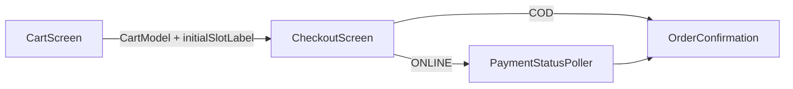
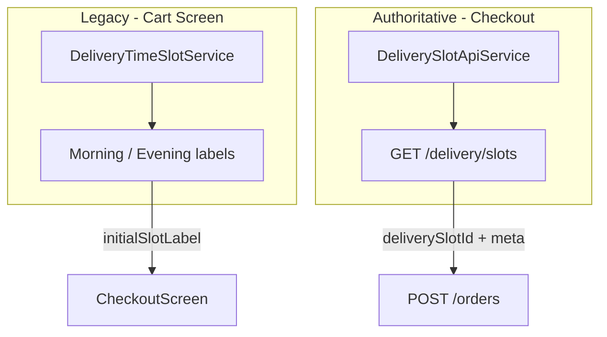
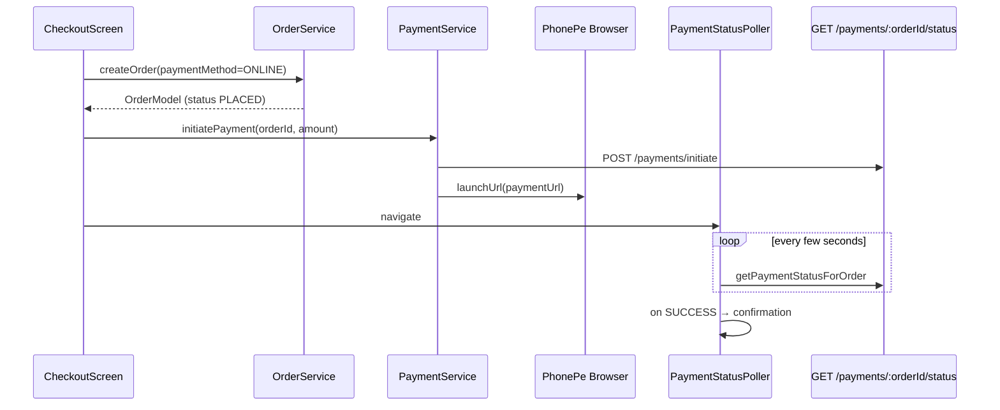

# Flutter Checkout Flow

Client-side checkout architecture for the MeatvoApp Flutter app (`frontend/`). This document maps screens, services, and API calls to the backend checkout pipeline.

**Backend reference:** [Checkout Pipeline Architecture](../../backend/docs/checkout-pipeline-architecture.md)

---

## Table of Contents

1. [Overview](#1-overview)
2. [Screen Flow](#2-screen-flow)
3. [Services Map](#3-services-map)
4. [Cart Sync Requirements](#4-cart-sync-requirements)
5. [Delivery Slot Integration](#5-delivery-slot-integration)
6. [Order Placement](#6-order-placement)
7. [Payment Flow (ONLINE)](#7-payment-flow-online)
8. [Client ↔ Backend Mismatches](#8-client--backend-mismatches)
9. [File Index](#9-file-index)

---

## 1. Overview

The Flutter app implements checkout as a linear flow:

```
CartScreen → CheckoutScreen → (PaymentStatusPoller if ONLINE) → OrderConfirmation
```

All cart mutations must sync to the backend Redis cart before order placement. The backend creates orders exclusively from server-side cart state.



---

## 2. Screen Flow

### CartScreen

**File:** `lib/screens/cart/cart_screen.dart` (referenced from navigation)

**Behavior:**
- Displays local `CartModel` from `CartService.cartNotifier`
- Uses `DeliveryTimeSlotService` for Morning/Evening slot **labels only** (legacy client-side windows)
- Passes `initialSlotLabel` to checkout for name matching
- Cart CRUD goes through `CartService` → `/api/cart`

**Important:** The local slot labels on the cart screen are **not** the authoritative delivery slots. Real slot IDs come from the backend API on checkout.

### CheckoutScreen

**File:** `lib/screens/checkout/checkout_screen.dart`

**Initialization:**
- Receives `CartModel cart` and optional `couponCode`, `initialSlotLabel`
- Loads delivery slots via `DeliverySlotApiService.fetchSlots(date:)`
- Loads saved addresses
- Validates delivery radius via `DeliveryService`

**Place order sequence (`_placeOrder`):**

1. Validate address selected with lat/lng pinned
2. Validate slot selected
3. Re-fetch slots for selected date; verify chosen slot still available (`isFull` check)
4. Validate delivery address in service radius (`DeliveryService.validateDeliveryAddress`)
5. Build `deliveryAddressJson` and `deliverySlotMeta` from fresh slot
6. Call `OrderService.createOrder()` with `deliverySlotId`, `deliverySlotMeta`, `paymentMethod`
7. If ONLINE: `PaymentService.initiatePayment()` → open PhonePe URL → navigate to `_PaymentStatusPoller`
8. If COD: navigate to confirmation

**Error handling (`_friendlyError`):**
- Maps stock, slot, cart-empty, and coordinate errors to user-friendly messages

### PaymentStatusPoller

**File:** `lib/screens/checkout/checkout_screen.dart` (private widget `_PaymentStatusPoller`)

**Behavior:**
- Polls `PaymentService.getPaymentStatusForOrder(orderId)` on interval
- On SUCCESS: navigate to order confirmation
- On FAILED/timeout: show retry or cancel options

### Checkout UI widgets

| Widget | File | Purpose |
|--------|------|---------|
| Address section | `lib/widgets/checkout/checkout_delivery_sections.dart` | Address picker, slot picker, payment method |
| Delivery sections | same | Date tabs, slot list with `isFull` disable |

---

## 3. Services Map

### CartService

**File:** `lib/services/cart_service.dart`

| Method | API | Notes |
|--------|-----|-------|
| `getCart()` | GET `/cart` | Updates `cartNotifier` |
| `addToCart(productId, quantity)` | POST `/cart/add` | |
| `updateQuantity(productId, quantity)` | PUT `/cart/:itemId` | |
| `removeFromCart(productId)` | DELETE `/cart/:itemId` | |
| `clearCart()` | DELETE `/cart/clear` | |
| `getCartCount()` | GET `/cart/count` | Updates badge notifier |

**Provider:** `cartServiceProvider` (Riverpod)

### OrderService

**File:** `lib/services/order_service.dart`

| Method | API | Notes |
|--------|-----|-------|
| `createOrder(...)` | POST `/orders` (via `placeOrder`) | Validates delivery radius first |
| `placeOrder(...)` | POST `/orders` | Builds request body |
| `getOrders()` | GET `/orders` | |
| `getOrderById(id)` | GET `/orders/:id` | |
| `cancelOrder(id)` | PUT `/orders/:id/cancel` | |

**Request body sent by `placeOrder`:**

```dart
{
  'addressId': '...',           // optional
  'deliveryAddress': '...',     // formatted string, min 10 chars
  'lat': 28.6,
  'lng': 77.2,
  'deliverySlotId': 12,         // when slot selected
  'deliverySlot': {             // meta from DeliverySlotModel.toOrderPayload()
    'name': 'Morning',
    'date': '2026-05-25',
    'time': '7:00 AM - 11:00 AM'
  },
  'paymentMethod': 'COD' | 'ONLINE',
  'items': [{ 'productId': '1', 'quantity': 2 }],  // IGNORED by backend
  'couponCode': 'SAVE10',       // IGNORED by backend at create time
}
```

### DeliverySlotApiService

**File:** `lib/services/delivery_slot_api_service.dart`

| Method | API | Used in checkout? |
|--------|-----|-------------------|
| `fetchSlots({date})` | GET `/delivery/slots?date=` | Yes |
| `getSlotById(id)` | GET `/delivery/slots/:id` | No (available) |
| `bookSlot(id)` | POST `/delivery/slots/:id/book` | **No** — booking via order create |

**Helpers:**
- `availableDates(days: 7)` — today + next 6 days
- `formatDateLabel(date)` — "Today", "Tomorrow", or weekday label

### PaymentService

**File:** `lib/services/payment_service.dart`

| Method | API | Status |
|--------|-----|--------|
| `initiatePayment(orderId, amount, ...)` | POST `/payments/initiate` | Working |
| `getPaymentStatusForOrder(orderId)` | GET `/payments/:orderId/status` | Working — used by poller |
| `verifyPayment(transactionId)` | POST `/payments/verify` | **Backend route missing** |
| `initiateUPIPayment(...)` | None (UPI deep link) | Legacy fallback, no gateway verification |

### DeliveryService

**File:** `lib/services/delivery_service.dart`

| Method | API | Used in checkout |
|--------|-----|------------------|
| `ensureDeliveryAvailable(lat, lng)` | `/store/check-delivery` | Pre-order in `createOrder` |
| `validateDeliveryAddress(lat, lng)` | same | Pre-order in `_placeOrder` |

### DeliveryTimeSlotService (legacy)

**File:** `lib/services/delivery_time_slot_service.dart`

Client-only Morning/Evening time windows based on business hours. Used on cart screen for display labels. **Not connected to backend slot capacity.**

---

## 4. Cart Sync Requirements

### Rule

The backend order is built from Redis (`cart:user:{userId}`), not from the Flutter `CartModel` passed to checkout.

### Required client behavior

1. Every add/update/remove on cart screen must call `/api/cart` **before** navigating to checkout
2. Checkout should ideally call `CartService.getCart()` on open to refresh local model from server
3. Do not rely on offline/local-only cart state for order placement

### Sync failure scenarios

| Scenario | Symptom |
|----------|---------|
| Local cart has items server cart doesn't | Order created with fewer/different items |
| Server cart has items local cart doesn't | Order includes extra items user didn't see |
| Variant ID=local only | Backend has no variant support; variantId ignored |

### CartModel vs backend

| Field | Flutter `CartModel` | Backend Redis |
|-------|---------------------|---------------|
| Product ID | `productId` (string) | Map key (string) |
| Quantity | `quantity` (double) | integer |
| Variant | `variantId` optional | not supported |
| Price | local calculation | server price at GET/order time |

---

## 5. Delivery Slot Integration

### Two slot systems



### Checkout slot selection

1. User picks date tab → `fetchSlots(date: _selectedDate)`
2. User picks slot from list (disabled if `isFull`)
3. On place order: fresh fetch + ID match + `isFull` re-check
4. `freshSlot.toOrderPayload()` → `deliverySlotMeta`
5. `deliverySlotId: freshSlot.id` sent to backend

### Slot model

**File:** `lib/models/delivery_slot_model.dart`

Fields from API: `id`, `name`, `time`, `date`, `capacity`, `booked`, `remaining`, `isFull`, `isToday`

`toOrderPayload()` returns `{ name, date, time }` for order address JSONB.

---

## 6. Order Placement

### createOrder call chain

```
CheckoutScreen._placeOrder()
  → OrderService.createOrder(cart, deliveryAddress, deliverySlot, ...)
    → DeliveryService.ensureDeliveryAvailable()  // radius check
    → OrderService.placeOrder(items: cart.items, ...)
      → POST /orders
```

### Pre-order validations (client-side)

| Check | Where |
|-------|-------|
| Address selected | `_placeOrder` |
| Lat/lng present | `_placeOrder` |
| Slot selected | `_placeOrder` |
| Slot still available | fresh `fetchSlots` + `isFull` |
| Delivery in radius | `validateDeliveryAddress` |
| Cart non-empty | `OrderService.createOrder` |
| Delivery radius | `ensureDeliveryAvailable` in `createOrder` |

### Post-order response parsing

`OrderService._parseOrderResponse()` extracts:
- `order` object from response `data.order` or `data`
- `pricing.subtotal`, `pricing.deliveryCharge`, `pricing.totalAmount`
- Falls back to `getOrderById` if items missing in response

---

## 7. Payment Flow (ONLINE)



### Payment method selection

Checkout supports `COD` and `ONLINE` (case-normalized to uppercase before API call).

### Amount passed to payment

```dart
amount: order.finalAmount > 0 ? order.finalAmount : _total
```

Backend validates amount from order row during initiation — client amount is informational for PhonePe redirect context.

### Do not use verifyPayment

`PaymentService.verifyPayment()` calls `POST /payments/verify` which does not exist on the backend. Use `getPaymentStatusForOrder()` instead.

---

## 8. Client ↔ Backend Mismatches

| Topic | Flutter behavior | Backend behavior | Action for developers |
|-------|------------------|------------------|----------------------|
| Order items | Sends `items` array in body | Reads Redis cart only | Sync cart via `/api/cart` before checkout |
| Coupon | Sends `couponCode` | Ignored at create; preview via `/orders/apply-coupon` | Show server-computed total after coupon preview |
| Variants | `variantId` in items | Not supported | Do not expose variant picker until backend supports it |
| Slot booking | `bookSlot()` available but unused | Books inside `POST /orders` | Current checkout flow is correct |
| Payment verify | `POST /payments/verify` | Route missing | Use `GET /payments/:orderId/status` |
| Slot labels (cart) | Local Morning/Evening | API slots with capacity | Treat cart labels as hints only |
| Cart validate | No pre-checkout validate call | No validate endpoint | Handle errors at order time |

---

## 9. File Index

### Screens

| File | Role |
|------|------|
| `lib/screens/checkout/checkout_screen.dart` | Main checkout + payment poller |
| `lib/screens/cart/cart_screen.dart` | Cart display, navigate to checkout |

### Services

| File | Role |
|------|------|
| `lib/services/cart_service.dart` | Cart API client |
| `lib/services/order_service.dart` | Order CRUD |
| `lib/services/payment_service.dart` | PhonePe initiation + status |
| `lib/services/delivery_slot_api_service.dart` | Slot listing |
| `lib/services/delivery_time_slot_service.dart` | Legacy local slot labels |
| `lib/services/delivery_service.dart` | Radius validation |
| `lib/services/api_service.dart` | Dio HTTP client with auth |

### Models

| File | Role |
|------|------|
| `lib/models/cart_model.dart` | Cart + CartItem |
| `lib/models/delivery_slot_model.dart` | Slot from API |
| `lib/models/order_model.dart` | Order response |

### Config

| File | Role |
|------|------|
| `lib/config/api_config.dart` | Path constants (`ApiCartPaths`, `ApiOrderPaths`, etc.) |
| `lib/config/env_config.dart` | Base URL, PhonePe UPI fallback config |

### Widgets

| File | Role |
|------|------|
| `lib/widgets/checkout/checkout_delivery_sections.dart` | Address + slot + payment UI |

---

## API path constants

From `lib/config/api_config.dart`:

```dart
ApiCartPaths.cart       = '/cart'
ApiOrderPaths.orders    = '/orders'
ApiOrderPaths.applyCoupon = '/orders/apply-coupon'
ApiPaymentPaths.initiate = '/payments/initiate'
ApiPaymentPaths.verify   = '/payments/verify'   // no backend route
ApiDeliveryPaths.slots   = '/delivery/slots'
```

All paths are prefixed with `ApiConfig.baseUrl` (resolved via `backend_resolver.dart`).
